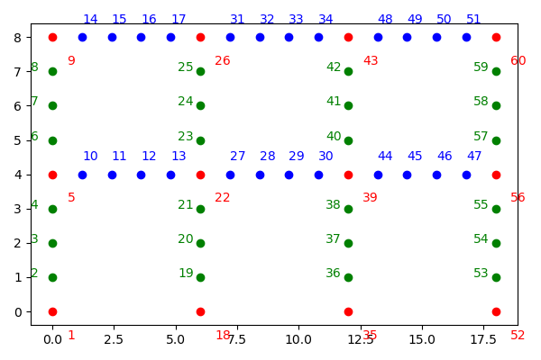
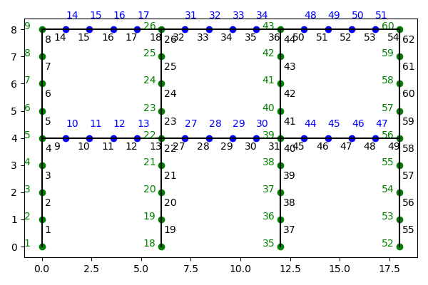

# Journal of Work
This journal contains the day-to-day project management and notes taken. It was also used as an indirect form of communication with the MSc supervisor so they are always up to date with my progress.

<figure style="text-align:center;">
  
</figure>

## Work plan
### WP1: Debugging of geometric nonlinearity - 2 weeks - due 15/06/2024 - COMPLETED
### WP2: Implementation of 1D nonlinear material - 8 weeks - due 23/09/2024 - COMPLETED
### WP3: Shared-memory parallelisation on Cirrus using Kokkos - 6 weeks - due 15/01/2024
### WP4: Internode parallelisation with MPI - 8 weeks - due 15/03/2025
### WP5: Profiling, data collection, and analysis - 3 weeks - due 07/04/2025
### WP6: Thesis writing - 05 weeks - due 15/05/2025

## Known Bugs
- [ ] Unable to factorise matrix - this happens for the Plastic Cantilever test where it takes multiple runs to correctly proceed.
- [ ] "could not find item with id 1 in vector." Occurs occasionally, and prevents running the model. As with the matrix factorisation, this resolves after running a couple of times. **Potentially fixed on 8 December by rewriting `get_id_iterator` in `basic_utilities.hpp`**


## Journal
### 11 December 
Huge day - built `Blaze` with `Kokkos` support. Not only did I integrate with the `Kokkos` build-system, but I also built the serial, `OpenMP`, and `C++ Threads` backends, and ran the code with them. The performance is very similar to `OpenMP`. To run the `C++ Threads` backend, need to define the environment variable `KOKKOS_NUM_THREADS` and set it to the number of threads. Performance with the `C++ Threads` infinitesimally better than `OpenMP` backend. The source code for `Kokkos` should be retrieved from the release section of the `Kokkos` github page. I am thrilled with today's accomplishment. Also, I am sure I had done quite some work yesterday - I might not have updated the journal, though. Better check my commits on the repo. 

### 8 December
All solution streamlining items from 6 December were implemented, in addition to combining the calculation of the stiffness contribution and the resistance force contributions. This resulted in nearly halving the assembly time from 0.93 s to 0.58 s, and thus reduced the proportion of the assembly from 10.93% in the last update, to 7.09% in this one. Other than the element state update, I am confident that the solution procedure is now implemented in a streamlined way. At the very least, it is not a clearly silly implementation anymore. All times below are the median of 3 runs.
| Timer Name                  | Original (s) | 4 Dec (s)    | 8 Dec (s)    | Original (%) | 4 Dec (%)    | 8 Dec (%)    |
|-----------------------------|--------------|--------------|--------------|--------------|--------------|--------------|
| U_to_nodes_mapping          | 0.17741060   | 0.17961621   | 0.17762160   | 1.99         | 2.09         | 2.16         |
| element_state_update        | 4.48823738   | 4.40222812   | 4.48953032   | 50.41        | 51.23        | 54.63        |
| element_global_response     | 0.47258306   | 0.00668526   | 0.00613523   | 5.31         | 0.08         | 0.07         |
| assembly                    | 0.80698061   | 0.93933296   | 0.58301473   | 9.06         | 10.93        | 7.09         |
| convergence_check           | 0.01368833   | 0.01499748   | 0.01306963   | 0.15         | 0.17         | 0.16         |
| dU_calculation              | 2.54351377   | 2.65354967   | 2.55872560   | 28.57        | 30.88        | 31.14        |
| material_state_update       | 0.40053082   | 0.39606977   | 0.38895583   | 4.50         | 4.61         | 4.73         |
| result_recording            | 0.00000095   | 0.00001144   | 0.00001287   | 0.00         | 0.00         | 0.00         |
| all                         | 8.90420794   | 8.59389591   | 8.21813107   | 100.00       | 100.00       | 100.00       |

I have also updated the `debug` build command in `build.sh`. This now builds a debug version of the code, and turns on verbosity for the load factor, iterations, and solution procedure thus outputing to the stream which part of the solution procedure each iteration has currently entered.

I have also added `OpenMP` parallel for-loops pragmas in 3 places: mapping displacements between nodes and $\boldsymbol{U}$ vector, element state updating, and updating material state. Of course, before attempting to see how that changes performance, I had to check whether the program compiles with `gcc-14` at all. Not only did it compile, but it also performed better than when it was compiled with `Clang`:
| Timer Name                  | Clang (s)    | g++-14 (s)   | Clang (%)    | g++-14 (%)   |
|-----------------------------|--------------|--------------|--------------|--------------|
| U_to_nodes_mapping          | 0.17762160   | 0.23869801   | 2.16         | 3.11         |
| element_state_update        | 4.48953032   | 4.02224493   | 54.63        | 52.43        |
| element_global_response     | 0.00613523   | 0.00586247   | 0.07         | 0.08         |
| assembly                    | 0.58301473   | 0.59288311   | 7.09         | 7.73         |
| convergence_check           | 0.01306963   | 0.01441932   | 0.16         | 0.19         |
| dU_calculation              | 2.55872560   | 2.40936303   | 31.14        | 31.41        |
| material_state_update       | 0.38895583   | 0.38600421   | 4.73         | 5.03         |
| result_recording            | 0.00001287   | 0.00001049   | 0.00         | 0.00         |
| all                         | 8.21813107   | 7.67104411   | 100.00       | 100.00       |

Now, running with very simple `OpenMP` resulted in the following change in performance on my Mac:
| Timer Name                  | Serial (s)   | 1 thread (s) | 2 threads (s) | 3 threads (s) | 4 threads (s) | 5 threads (s) | 6 threads (s) |
|-----------------------------|--------------|--------------|---------------|---------------|---------------|---------------|---------------|
| U_to_nodes_mapping          | 0.23869801   | 0.24094439   | 0.14099669    | 0.10458899    | 0.08529949    | 0.09684801    | 0.08928013    |
| element_state_update        | 4.02224493   | 4.16897321   | 2.34216547    | 1.78291416    | 1.52907467    | 1.68174362    | 1.54701853    |
| element_global_response     | 0.00586247   | 0.00615382   | 0.00636268    | 0.00614691    | 0.00619173    | 0.00643182    | 0.00616169    |
| assembly                    | 0.59288311   | 0.59401011   | 0.59843707    | 0.59329438    | 0.61001730    | 0.59858918    | 0.61685324    |
| convergence_check           | 0.01441932   | 0.01422381   | 0.01437068    | 0.01404953    | 0.01449251    | 0.01484466    | 0.01489782    |
| dU_calculation              | 2.40936303   | 2.41919684   | 2.42342472    | 2.41524863    | 2.45679283    | 2.45992088    | 2.46733403    |
| material_state_update       | 0.38600421   | 0.39710569   | 0.31511736    | 0.30846882    | 0.30860162    | 0.31389737    | 0.31257939    |
| result_recording            | 0.00001049   | 0.00001407   | 0.00001526    | 0.00001001    | 0.00001931    | 0.00001907    | 0.00001740    |
| all                         | 7.67104411   | 7.84207821   | 5.84252691    | 5.22638988    | 5.01214504    | 5.17397404    | 5.05578804    |

And as percentage of total time:
| Timer Name                  | Serial (%)   | 1 thread (%) | 2 threads (%) | 3 threads (%) | 4 threads (%) | 5 threads (%) | 6 threads (%) |
|-----------------------------|--------------|--------------|---------------|---------------|---------------|---------------|---------------|
| U_to_nodes_mapping          | 3.11         | 3.07         | 2.41          | 2.00          | 1.70          | 1.87          | 1.77          |
| element_state_update        | 52.43        | 53.16        | 40.09         | 34.11         | 30.51         | 32.50         | 30.60         |
| element_global_response     | 0.08         | 0.08         | 0.11          | 0.12          | 0.12          | 0.12          | 0.12          |
| assembly                    | 7.73         | 7.57         | 10.24         | 11.35         | 12.17         | 11.57         | 12.20         |
| convergence_check           | 0.19         | 0.18         | 0.25          | 0.27          | 0.29          | 0.29          | 0.29          |
| dU_calculation              | 31.41        | 30.85        | 41.48         | 46.21         | 49.02         | 47.54         | 48.80         |
| material_state_update       | 5.03         | 5.06         | 5.39          | 5.90          | 6.16          | 6.07          | 6.18          |
| result_recording            | 0.00         | 0.00         | 0.00          | 0.00          | 0.00          | 0.00          | 0.00          |
| all                         | 100.00       | 100.00       | 100.00        | 100.00        | 100.00        | 100.00        | 100.00        |

Finally, I have updated `get_id_iterator` in `basic_utilities` by using `std::find_if` from the standard template library. This actually appears to have some effect on performance as well. This, hopefully, will fix one of the known bugs.

### 6 December
During assembly, it is important correctly size the vector that will take on the element contributions to the stiffness matrix. This reservation of `std::vector` size should be an upper limit, but setting it to a very large size will have performance and memory costs. The notebook `element_contribution_count.ipynb` in `POC` counts the number of nonzero contributions of `Nonlinear2DPlasticBeamElement`. The number of contirbutions depends on the orientation of the element as the global contributions include the transformed tangent matrix: $\boldsymbol{T}^T \boldsymbol{k}_t \boldsymbol{T}$. For a horizontal or vertical element, there are 28 nonzero elements, and 36 if the element is neither horizontal nor vertical. This means that the size of the vector of tuples that build the sparse matrix should be 36 * number of elements, as an upper limit. 

The function `Assembler::assemble_global_contributions(GlobalMesh& glob_mesh)` assembles both stiffness matrix $\boldsymbol{K}$ and force vector $\boldsymbol{P}$, and does so by declaring, allocating, and filling 4 `std::vectors` to collect the triplets each iteration. 
1. There is no need to assemble $\boldsymbol{P}$ each iteration, but only each load step.
2. The vector for the contributions of the stiffness matrix should be reserved once, and reused without having to re-reserve elements each iteration. 
3. The number of copies must be reduced by not copying the contributions to a temporary vector and then into the global vector. In stead, a new function `insert_global_stiffness_triplets(std::vector<spnz>& global_triplets_vector)` is used to directly insert the contributions into the global contributions triplets vector.
4. It could be done so that the insertion into the contributions triplets vector be done as part of the element updating, so that we do not compute the contributions and then collect them, but in stead directly place them into the global vector of triplets. This will require passing the global vector of triplets to the element update function, which in turn would make it difficult to parallelise element updating as there could be race-conditions when writing to the global stiffness triplets vector. 


### 4 December
Following up on the **Now What?** section, I have done the things listed there and this resulted in the following change in performance on my Mac:
| Timer Name                  | Original (s) | Modified (s) | Original (%) | Modified (%) |
|-----------------------------|--------------|--------------|--------------|--------------|
| U_to_nodes_mapping          | 0.17741060   | 0.17961621   | 1.99         | 2.09         |
| element_state_update        | 4.48823738   | 4.40222812   | 50.41        | 51.23        |
| element_global_response     | 0.47258306   | 0.00668526   | 5.31         | 0.08         |
| assembly                    | 0.80698061   | 0.93933296   | 9.06         | 10.93        |
| convergence_check           | 0.01368833   | 0.01499748   | 0.15         | 0.17         |
| dU_calculation              | 2.54351377   | 2.65354967   | 28.57        | 30.88        |
| material_state_update       | 0.40053082   | 0.39606977   | 4.50         | 4.61         |
| result_recording            | 0.00000095   | 0.00001144   | 0.00         | 0.00         |
| all                         | 8.90420794   | 8.59389591   | 100.00       | 100.00       |

As can be seen from the table, the workload for `element_global_reponse` has reduced drastically to only 0.08% of the total as compared to 5.31%. As can also be seen, the overall time reduced by about 0.4 s from 8.9 s to 8.59 s, which corresponds closely to the reduction in `element_global_reponse` from 0.477 s to 0.007 s. That being said, `element_global_reponse` needs to be renamed to `global_load_calculation` or something similar. I suspect this will include an assembly step in the future, so I will await to see how this will be done and changed before renaming it.


### 3 December
It has been quite a while since I have last written here. While some of this is due to interruptions in my life, it also just has to do with the fact that I have simply not written here since I have been focused on writing code that took effort but did not need much thought. The `FrameMesh` class has been added to the `Aggregators` library. It has been documented, and is built based on the proof of concept under the `POC` directory. There are no unit tests associated with it becuase they would require a lot of work and effort, but do not offer any technical benefit. `FrameMesh` allows building portal frames as shown in the figures below. Note that the nodal numbering was attempted in a way to make the differences in ID between nodes of one elements small. This should help keep the bandwidth of the stiffness matrix limited, as far as I know at least. There is only one section type for the beams and columns, which while not ideal, changes nothing for the performance analysis.

In this figure, the *vertices* are in red, while the beam nodes are in blue, and the column nodes are in green. There are functions in `FrameMesh` that allow for extracting these numbers and for defining the coordinates of each node.
<figure>
  
  <figcaption> ID numbers of the nodes in a portal frame </figcaption>
</figure>

In addition to creating the nodes, there are functions to map the nodes to elements, which are shown below as well. These features have already been added to the `GlobalMesh` and `Model` classes to allow very easy creation of portal frames. Additionally, the `FrameMesh` class allows for easily getting the node IDs for beams that would be loaded, column baes, and getting the node IDs for nodes that will require out-of-plane restraint. See the `FrameMesh` class for details as it is now fully documented. 
<figure>
  
  <figcaption> ID numbers of the nodes in a portal frame along with element IDs </figcaption>
</figure>

In addition to having built the `FrameMesh` class, I have also ran a few trials to evaluate the runtime, especially on `Archer2` and `Cirrus`. I have found out why running on `Cirrus` was taking forever - it is because of the `Eigen` module. This issue persists on `Archer2`. If I were to build `Blaze` linking to the module, then the performance of the entire program, not just the functions related to `Eigen`, is completely destroyed. However, if I were to *make* my own `Eigen` by following the `Archer2` documentation: 
```console
wget https://gitlab.com/libeigen/eigen/-/archive/3.4.0/eigen-3.4.0.tar.gz
tar xvf eigen-3.4.0.tar.gz
cmake eigen-3.4.0/ -DCMAKE_INSTALL_PREFIX=/path/to/install/location
make install
```
where I would install `Eigen` under the directory `eigen` located just before the `Blaze` directory. That is:
```console
cd ..
wget https://gitlab.com/libeigen/eigen/-/archive/3.4.0/eigen-3.4.0.tar.gz
tar xvf eigen-3.4.0.tar.gz
rm eigen-3.4.0.tar.gz
mkdir eigen
cd eigen-3.4.0
mkdir build
cd build
cmake .. -DCMAKE_INSTALL_PREFIX=../../eigen
make install
```
And then I would use `CMake` as usual, and it will manage to find `Eigen` without problems. 
I have run the following problem: 10 bays, and 5 floors. 3.5 m floor height, and 5 m beam length. Element size at 0.1 m, for 50 beam-column elements per beam and 35 per column. Top floor nodes loaded with -1000 N each in the y direction. Load is applied over 100 steps, with a tolerance of 10e-2, and 10 maximum iterations. This resulted in the following data, which corresponded to only one run:
| Timer Name                  | My Mac (s) | Cirrus (s) | Archer 2 (s) | My Mac (%) | Cirrus (%) | Archer 2 (%) |
|-----------------------------|------------|------------|--------------|------------|------------|--------------|
| U_to_nodes_mapping          | 0.17741060 | 0.34582329 | 0.50094271   | 1.99       | 1.80       | 2.92         |
| element_state_update        | 4.48823738 | 9.18213558 | 8.88480496   | 50.41      | 47.89      | 51.85        |
| element_global_response     | 0.47258306 | 1.18095469 | 1.03989220   | 5.31       | 6.16       | 6.07         |
| assembly                    | 0.80698061 | 1.52394438 | 1.32624269   | 9.06       | 7.95       | 7.74         |
| convergence_check           | 0.01368833 | 0.02285123 | 0.02309489   | 0.15       | 0.12       | 0.13         |
| dU_calculation              | 2.54351377 | 5.76609898 | 4.36792111   | 28.57      | 30.07      | 25.49        |
| material_state_update       | 0.40053082 | 1.14883661 | 0.99075556   | 4.50       | 5.99       | 5.78         |
| result_recording            | 0.00000095 | 0.00005174 | 0.00003219   | 0.00       | 0.00       | 0.00         |
| all                         | 8.90420794 | 19.17318392| 17.13679385  | 100.00     | 100.00     | 100.00       |

From this data, it can be seen that `Cirrus` and `Archer 2` perform worse than my M1 macbook air by a factor of about 2, with `Archer 2` coming slightly ahead of `Cirrus`. The numbers in the table above corresponded to a single run simply because it is not currently worthwhile to try and get averages of performance or anything. I did run multiple times, and the results are within 1 or 2 seconds everytime, while the percentages do not change. I have also made sure that the load factor is incremented correctly and that this corresponds to a solution being calculated; there is no benchmark to check this solution, however. What is also quite important to note is that the performance percentages are not very different between the different machines. Well, there are some differences in percentages between my Mac and the HPC systems, but across `Cirrus` and `Archer 2` the proportions are about the same.

**Now What?**
So what is the next step? Well, first of all I need to streamline the first four steps in the solution process:
1. U to nodes mapping
2. Element state update
3. Element global response 
4. Assembly

These were selected because I recall I had done them in a rather inefficient way. I will start there by looking at the file `solution_procedure.md`. 

- `Assembler::map_U_to_nodes(GlobalMesh& glob_mesh)`: this function has to go over every node, and then from the node find the index at which the DoFs of this node start in the $\boldsymbol{U}$ vector, and how many they are so it can create a loop. It then also needs to know what are the active DoFs of this node, so that it can use a function to add these DoFs. We can speed this up by:
  1. Vectorise the transfer of the nodes from $\boldsymbol{U}$ since we know the DoFs will be continguous, but this will require some masking at the node so it can properly map this vector to where it belongs in its active DoFs. 
  2. Another idea is to link the nodal displacement container directly to $\boldsymbol{U}$ so that when $\boldsymbol{U}$ is filled, the nodal displacement container is also directly filled and we no longer need this function to beging with.
  3. Although the order of the nodes and the way the active DoFs do not change during the solution procedure, we are making a call to find the starting location, active DoFs, and their number every time. This can be done once and stored, and then each iteration can just use that *map* to find the loop parameters. I do not see this making a major improvement, though, as we only reduced some function calls but still need to read a map and copy the nodal data.
  4. Added an `OpenMP` parallel-for directive here.
- `GlobalMesh::update_elements_states()`: loops over all elements and asks them to update their state. Not much can be done about this to speed it up, actually, at least not at the `SolutionProcedure` level. Fixing this will require element-level optimisation.
- `GlobalMesh::calc_global_contributions()` loops over the elements and calls `calc_global_stiffness_triplets()`, then loops over the nodes and calls `compute_global_load_triplets()`. The following was done:
  1. The call `calc_global_stiffness_triplets()` for each element is wasted here - it should be moved to `GlobalMesh::update_elements_states()`, and it was. 
  2. Create `GlobalMesh::calc_nodal_contributions_to_P` to loop over the nodes and get them calculate their global load triplets, move it to before the iterations since $\boldsymbol{P}$ does not change during the iterations. This might become a problem when introducing fire if fire would change $\boldsymbol{P}$, but get to that bridge when we get to it, and perhaps separate thermal load from dead load to begin with. 

#### 12 November
The `2DFrame` class will have the following:
- A function that will return the vertix number for a particular column line and floor.
- A function that will return the vertice numbers of a particular bay and floor - relies on the previous function and just gives it two column lines.
- A function that will return the node numbers of particular bay and floor *excluding the vertices*.
- Loop over all bays for a given floor, and append both the vertices and nodes for each into an **ordered set**.
  - The ordered set does not allow repeats and will order the node numbers thus giving a nice, ordered set.
- Build the elements for one "beam" at a time - using the previous ordered set to create the connectivity, and to easily create the nodes by simply incrementing the $x$ position by $dx$.
- Do something similar for the columns being careful not to double-creat the vertice nodes which can be done by a set operation to exclude the vertices from the nodes of a column.
- Should find a way to specify different sections for beams and columns.

The following variabels need to be passed to `CMake` on `Cirrus`:
```console
-DEigen3_DIR=/work/y07/shared/cirrus-software/eigen/eigen-3.4.0/cmake -DEIGEN3_INCLUDE_DIR=/work/y07/shared/cirrus-software/eigen/3.4.0/include/
```
Something interesting happened today. Running `Blaze` on `Cirrus` results in a much slower runtime. 3600 element did not complete in any resonable time, nor did 360! 100 elements take between 49 s to 55 s to run (login node)!! On my Macbook, this time was 0.78 s!!!


#### 3 November
- [x] A time-manager class that allows tracing the runtime of the different `Blaze` functions for performance analysis.
- [ ] A large-scale problem that I can use for performance-analysis of `Blaze`.
- [ ] Inclusion of `Kokkos` into `Blaze` for shared-memory parallelisation.
- [ ] Development of a class architecture for `MPI` parallelisation of `Blaze` on distributed memory systems.

I have added the `TimeKeeper` and `ExecutionTimer` classes under `managers/performance_analysis`. These two classes build just fine and produce very useful information for characterising the performacne of `Blaze`.
I will need to do some performance analysis on the serial version of `Blaze` before I go onto parallelisation. It might also be worthwhile to parallelise with `OpenMP` first given how quick and easy it would be, and that would also give me another datapoint to compare against `Kokkos` later. Although `TimeKeeper` and `ExecutionTimer` have been written, documented, and used to time `solution_procedure`, they are not currently being tested at all. I will need more elaborate measures to track not only the time of solution, but also the quality. Some mesh discretisations result in divergence under the same convergence criteria. I might need to test other solvers as well. In addition to timing the `solution_procedure`, I could time the beam-column elements I am interested in testing, and also time the different *build styles* of `Blaze` where we would build the static library vs building using the *include-only* configuration. The latter will likely result in better optimisation. Other things that `Blaze` might benefit from include an Eigen-solver for linear buckling analysis, and a dynamic solver for transient problems. I clearly have lots to think about, and unending sea of work to do. Exciting, nonetheless.

#### 2 November
New build system now works correctly. Following still needed:
- [x] Fast build option where only includes are performed and no incremental library builds necessary.
- [x] Testing build options.
- [x] Build-options and configuration file embedded into build-system allowing configuration of `Blaze` debug flags from the build system.
- [ ] Correction of how Eigen3 is included into build system. <span style="color:green;"> **Actioned by sending support request via Safe.**</span>
- [x] Correctly identifying whether `PUBLIC` or `PRIVATE` flags necessary for building the different libraries of `Blaze`.
- [x] Documentation of the different libraries of `Blaze`, and perhaps include that in `Doxygen`.
- [x] Fix how VSCode handles includes. DONE: simply added `"${workspaceFolder}/source/**"` to the `includePath` in `c_cpp_properties.json`.

Most of the header files in `Blaze`, except maybe the interfaces (base classes), are expected to be called within the `main` program. As such, the 6 or so libraries of `Blaze` are all `PUBLIC` rather than `PRIVATE`. The latter applies if the libraries are only needed to be built as part of some other libraries, but not necessarily called by other parts of the program like `main`. I hope I am right, but even if I am wrong it is not a big deal!

Now `Doxygen` will also include the `README.md` file, and the `Blaze_libraries.md` documentation of the different libraries of `Blaze`. Very useful.

**Test continues to fail for plastic beam-column - need to figure out why**

### Tasks for next step
- [ ] A time-manager class that allows tracing the runtime of the different `Blaze` functions for performance analysis.
- [ ] A large-scale problem that I can use for performance-analysis of `Blaze`.
- [ ] Inclusion of `Kokkos` into `Blaze` for shared-memory parallelisation.
- [ ] Development of a class architecture for `MPI` parallelisation of `Blaze` on distributed memory systems.  

#### 31 October
New build system now works correctly. Following still needed:
- [ ] Fast build option where only includes are performed and no incremental library builds necessary.
- [ ] Testing build options.
- [ ] Build-options and configuration file embedded into build-system allowing configuration of `Blaze` debug flags from the build system.
- [ ] Correction of how Eigen3 is included into build system.
- [ ] Correctly identifying whether `PUBLIC` or `PRIVATE` flags necessary for building the different libraries of `Blaze`.
- [ ] Documentation of the different libraries of `Blaze`, and perhaps include that in `Doxygen`.
- [x] Fix how VSCode handles includes. DONE: simply added `"${workspaceFolder}/source/**"` to the `includePath` in `c_cpp_properties.json`.
#### 20 October
So the test `SimplySupportedUdlPlastic.CheckResult` returns an error where the stiffness matrix contains `NaN` values in the diagonal when run for the first, but not the second time. I do not know what it is caused by. Sometimes it persists for a couple of times, and some times it goes away rather quickly. I have not faced this with the main executable. 

I have now moved all my function definitions into header files - my only `cpp` file is `main.cpp`. Of course, I had to create empty `.cpp` files that simply include their respective headers so that I can see the incremental building and more easily locate where errors are encountered. I have to do something with my `CMake` file so that I can choose to directly just build `main.cpp` without having to build individual empty `cpp.o` objects that are then linked. This will help with performance optimisation since all definitions will be in one file. I also want to reorganise my folder structure so that I can more easily navigate my project - that is, I want to move elements to an element directory, and perhaps `Scribe`, `LoadManager`, `materials`, and what I can think of into separate directories that make the project easier to navigate. I will need a better understanding how to do this without breaking my project, though, and I also need to find out how to properly build `Kokkos` and `GoogleTest` on Cirrus and Archer2. For this, I will need a **much** better understanding of `CMake`. 

##### [CMake Tutorial](https://cmake.org/cmake/help/latest/guide/tutorial/index.html)
I learned something very important: I can use `CMake` to create a version of a header file where the definitions in the header file come from `CMake`. For example, in my `CMakeLists.txt` I would have:
```cmake
project(Tutorial VERSION 1.0)
...
set(PINA_COLLADA "\"I like pina colladas!\"")
...
configure_file(TutorialConfig.h.in ../TutorialConfig.h)
```
While in a header file called `TutorialConfig.h.in` I would have:
```cpp
#define Tutorial_VERSION_MAJOR @Tutorial_VERSION_MAJOR@
#define Tutorial_VERSION_MINOR @Tutorial_VERSION_MINOR@
#define PINA_COLLADA @PINA_COLLADA@
``` 
Where the variable enclosed in `@` is the name of the variable define in `CMakeLists.txt`. This generates a file called `TutorialConfig.h` that has:
```cpp
#define Tutorial_VERSION_MAJOR 1
#define Tutorial_VERSION_MINOR 0
#define PINA_COLLADA "I like pina colladas!"
```
and copies everything not defined by `CMake` from the original `TutorialConfig.h.in`. A very important note is that this generation is configured by the command `configure_file` where the first input path is given **relative** to `${PROJECT_SOURCE_DIR}`, while the second input (output of the configuration command) is relative to `${PROJECT_BINARY_DIR}`.

##### Step 2 of CMake Tutorial
In this second step of the tutorial, I learned how to create multiple directories, create libraries at these directories, and then link them together conditionally based on definitions in `CMakeLists.txt` in a more efficient way than creating a new header file.


**Building with multiple subdirectories**
1. At the subdirectory where my subdirectory source files are, I create a new `CMakeLists.txt` file with the command `add_library(LibraryName [type] <library_source_files>)`. The optional argument `[type]` can be one of the [following options](https://cmake.org/cmake/help/latest/command/add_library.html#add-library):
   1. `STATIC`: "An archive of object files for use when linking other targets."
   2. `SHARED`: "A dynamic library that may be linked by other targets and loaded at runtime."
   3. `MODULE`: "A plugin that may not be linked by other targets, but may be dynamically loaded at runtime using dlopen-like functionality."
2. I add the subdirectory to my main `CMakeLists.txt` with the command `add_subdirectory(SubdirectoryName [binary_dir])` where `[binary_dir]` is an optional input that tells `CMake` where to place the output files for that subdirectory. By default, this will be the same as the `SubdirectoryName` or better known as `source_dir`.
3. We built a library, so we should link our executable with it. This is done via `target_link_libraries(TargetName INTERFACE/PUBLIC/PRIVATE LibraryName)`. Where the following keywords define [scope](https://cmake.org/cmake/help/latest/manual/cmake-buildsystem.7.html#target-command-scope):
   1. `INTERFACE`: "Populates only properties for using a target."
   2. `PUBLIC`: "Populates both properties for building and properties for using a target."
   3. `PRIVATE`: "Populates only properties for building a target."
4. We need to tell `CMake` where to find the header files. This is done via `target_include_directories(TargetName INTERFACE/PUBLIC/PRIVATE <include_directories>)`.

**Building specific variations and libraries**
1. Create an `option` in the subdirectory `CMakeLists.txt` where the option will be used. This is done via `option(OPTION_NAME "option description" [ON/OFF])` where `[ON/OFF]` are the optional default value.
2. Use an if-statement with `if(OPTION_NAME) ... endif(OPTION_NAME)` and create a compile definition that will be, in a way, injected into the program via `target_compile_definitions(TargetName INTERFACE/PUBLIC/PRIVATE OPTION_NAME[=VALUE])` where `[=VALUE]` is an optional value to assign to the variable defined in the program.
3. Use the definition in the program by calling `#ifdef`, `#ifndef`, or `#if` directives. This can also include wrapping the `#include` directives.
4. Follow steps 1 and 3 from **Building with multiple subdirectories** above to add the newly built library and link it. 


**Quick Note:** To make a shell file executable on my Mac, I need to call `chmod +x ./*.sh `. This is important because having `bash` as a command in all my shell files is causing some issues on Cirrus and Archer2 where after running `build`, for example, I am getting some error messages after the operation stating that the input (which I just simply typed in my terminal) cannot be understood. Not a big deal as it does not do much damage (as far as I know), but is worth noting.

**Another Quick Note:** I should really consider trying my work with a higher precision floating point number - perhaps one of the 128 bit float that Adam uses in `Sparky`.

#### What improvements do I need to make the the build system of `Blaze`?
- Configure whether it links to `Eigen3` or some other mathematics library like `Sparky`.
- Link to `Eigen3` module without having to build from source if running on Archer2 or Cirrus. 
- Link to the correct version of `GoogleTest` based on which compiler is used. `GoogleTest` needs to be compiled with the same compiler as `Blaze`.
- Build and/or link to `Kokkos`.
- Decide whether or not to build a library, or simply build `main` with only header files included.
- Be able to choose level of optimisation to use when building release.
- Configure whether or not to include timers.
- Configure the level of debugging to include (the various `VERBOSE` flags). *unimportant*
  
#### 19 October
Today, I managed to compile with `gcc 12.3.0` on Cirrus, `gcc 11.3` on Archer2, and with `gcc 13.2.0` and `gcc 14.2.0` on my Mac. Note, however, that an OS update to my Mac now requires I use the following console command to use `gcc` successfully. 
```console
export SDKROOT=/Library/Developer/CommandLineTools/SDKs/MacOSX14.sdk
```
To change the compiler used by `CMake`, need to export the corresponding environment variables:
```console
export CC=gcc-14
export CXX=g++-14
export CF=gfortran
```
This was also useful for compiling on Archer2. It is important to also note that compiling on Cirrus and Archer2 requires installing Eigen3; I could not get the module to work on its own with `CMake`. I should ask @JamesPerry about this. The commands to install `Eigen3` were from the [Archer2 User Documentation](https://docs.archer2.ac.uk/software-libraries/eigen/). I also changed the `build.sh` command to release in stead of Debug just to check if it will still compile and thankfully it does.

```console
wget https://gitlab.com/libeigen/eigen/-/archive/3.4.0/eigen-3.4.0.tar.gz
tar xvf eigen-3.4.0.tar.gz
cmake eigen-3.4.0/ -DCMAKE_INSTALL_PREFIX=/path/to/install/location
make install
```
Another issue I faced is that I was unable to compile the tests with any `gcc` on my Mac. I found [this answer](https://stackoverflow.com/questions/17267306/gtest-undefined-symbols-for-architecture-x86-64-error-with-clang-and-stdvec) on StackOverflow: 

"If you compile gtest with the Apple g++ and installed gcc with e.g. homebrew, linking to gtest will cause this error.

So compile gtest and your project with the same compiler."

and I think it is mostly likely correct.

In addition to all of this, I managed to setup an Archer2 account and linked it to GitHub with ssh, and to login to Archer2 with VSCode. I was facing an issue where I did not notice that VSCode was actually requesting that I enter my ssh passphrase, which is done in the location where the search and command bar is usually located. Took me quite some time to figure it out!! I don't quite like it, though, as it makes navigation a bit difficult. I am sure it will come handy, however, when I have some code that needs writing or modifying while I run my tests. 

In conclusion, today has been quite productive and I am quite happy with myself. Tomorrow, though, I need to setup my goals for `Blaze` and a new plan for moving forward. Perhaps I should build a very large model, as well, and time it. Leaving this, however, for tomorrow. Good night.

#### 13 October
Ran the model again but this time with the GNA element without plasticity, and it gave, for the second iteration: $\boldsymbol{KU} = \boldsymbol{P} = \boldsymbol{R} = -33.33$. This indicates that the direction of the forces retrieved from the section is incorrect.

It appears direction of element stresses $\boldsymbol{\sigma} = \left[ F \ M\right]^T$ is not a problem:
- Elastic element section stresses are negative: -33.33
- Plastic element section stresses are ALSO negative: -33.33

The direction of the element resistance forces $\boldsymbol{f} = \left[F\ M_1\ M_2\right]$is the problem as shown below:
- Elastic element resistance froces are: $\left[ -33.3333\ 0\ 0\right]^T$
- Plastic element resistance forces are: $\left[33.3333\ -2.28055e-15\ 2.28055e-15\right]^T$

I managed to find the problem. I had written:
$$\boldsymbol{B} = \frac{\partial \boldsymbol{\varepsilon}}{\partial \boldsymbol{d}^T} = \begin{bmatrix} \frac{1}{L_0} & \frac{2\theta_1}{15} - \frac{\theta_2}{30} & -\frac{\theta_1}{30} + \frac{2\theta_2}{15} \\ 0 & -\frac{4}{L_0} + \frac{6x}{L_0 ^2} & -\frac{2}{L_0} + \frac{6x}{L_0 ^2}\end{bmatrix} $$ 
As: 
$$\boldsymbol{B} = \frac{\partial \boldsymbol{\varepsilon}}{\partial \boldsymbol{d}^T} = \begin{bmatrix} \frac{-1}{L_0} & \frac{2\theta_1}{15} - \frac{\theta_2}{30} & -\frac{\theta_1}{30} + \frac{2\theta_2}{15} \\ 0 & -\frac{4}{L_0} + \frac{6x}{L_0 ^2} & -\frac{2}{L_0} + \frac{6x}{L_0 ^2}\end{bmatrix} $$ 
In the function `calc_B` in both `Nonlinear2DBeamElement` and `Nonlinear2DPlasticBeamElement`. $\boldsymbol{B}$ is not used in `Nonlinear2DBeamElement` so it did not matter, but it is needed in `Nonlinear2DPlasticBeamElement` so everything broke.

There are still some bugs in the tests: `SimplySupportedUdlPlastic` and `CantileverBeamPlastic`. `PlasticBeamTests::ConstantCompressionStiffness` fails too, but is ill-posed to begin with. 
<span style="color:yellow;"> Turns out there was no issue with the model-level tests; I just had reintroduced the negative sign bug to simply take a screenshot to document the bug I had faced.</span> I also removed the ill-posed test `PlasticBeamTests::ConstantCompressionStiffness`. 

Now the main pain point is that `VSCode` is no longer playing nice with intellisense and I am getting a lot of incorrect error messages from the static analyser. I have been dealing with this for a couple of days, and I have not found a consistent way to resolve it. Last time, restarting helped. 

  
#### 12 October
Okay, so the problem does appear to arise due to the direction convention used for the plastic nonlinear elements. 

The way I am debugging this is by applying an axial force and tracking the element stress state because axial force is a lot easier to follow than moment. What I am finding by looking at the different vectors is that the resistance vector is coming out, for the first iteration, as positive 33.33, while the multiplication of K and U is returning -33.33. At the same time, the force vector applied has a negative sign of -33.33. Given that $\boldsymbol{G} = \boldsymbol{R} - \boldsymbol{P}$, I am getting an out of balance that is positive 66.66. What we can see is that there should not be an out-of-balance as the elements are resisting the axial forces, but the stiffness is returning the opposite. This means that out of balance keeps growing as we have seen, and it does so indefinitely!

Something seems to be the matter with the sign of the forces. I will need to investigate! It appears that this arises due to the negative sign in the sections - equations 18 and 19 from Izzuddin's nonlinear material material elements.

#### 7 October
- [x] Isolate test-helpers into their own file.
- [x] Add functionality to `update_material_starting_state` that is called by `solve` after each successful iteration, and before moving into the next load step.
- [ ] Figure out why `ModelTestsPlastic` is running into a segmentation fault (same for good ol' regular `Blaze` binary as well).
  - [ ] Figure out why `main` produces incorrect results regardless of element type being used.
- [ ] I also need a test to check that individual `Nonlinear2DPlasticBeamElement` are able to capture pure bending correctly.

Right now, I have added the function `update_element_sections_starting_states` to the `GlobalMesh` object, and it is called being called as expected. I am not sure if it work correctly, but my best way to test it is to test a model. This leads to the third item on the todo list: finding out why `ModelTestsPlastic` is running into a segmentation fault. During my initial testing, I found that `main.cpp` is not working correctly as the results predicted by the model are incorrect regardless of the finite element type being used.

**It is 9:30 PM now**

I found that the wrong element type was passed to the test thus resulting in a quick segmentation fault in the test. Main was giving incorrect results because the problem that was being solved was incorrectly setup. I changed to a cantilever beam and that works for the Elastic elements. 
- [x] Figure out why `ModelTestsPlastic` is running into a segmentation fault (same for good ol' regular `Blaze` binary as well).
  - [x] Figure out why `main` produces incorrect results regardless of element type being used.
With that being said, I am now running into an error where the out-of-balance keeps growing at higher iterations for my Plastic beam-column thus preventing convergence and resulting in NaN numbers in the stiffness matrix at very high out-of-balance. This happens with any model-level problem. I have figured out that a load 3500 (LF*0.35 initially, but now I reduced the load) is achievable for the state of `main.cpp` that is currently comitted - the final deflection achieved is  -0.00011352 which is very close to the correct value of -0.000115826. The beam is still elastic at this point, so I am not sure what is happening. I am completely at my wits' end with this. I need to start writing, and hopefully by doing that, I will be able to find what the problem is.


#### 1 October 
I noticed that something important that I was missing is a command to update the starting state of the section! Right now, `BeamColumnFiberSection` does not have a command to *commit* its state, nor does `Nonlinear2DPlasticBeamElement`. This means that each iteration, the starting state of all material fibres is the initial state! This needs to be added to the solution-procedure as well.

I found another problem today. I built a new set of model-level tests for the `Nonlinear2DPlasticBeamElement`, but I am getting a segmentation fault when they run. Something is happening during the utilisation of the plastic sections. I also found that a lot of unwanted tests are running because I am including other test files so I can use their helper functions. I should isolate these helper functions on their own in a helper function file. So, from this, I have three todos:

- [ ] Isolate test-helpers into their own file.
- [ ] Add functionality to `update_material_starting_state` that is called by `solve` after each successful iteration, and before moving into the next load step.
- [ ] Figure out why `ModelTestsPlastic` is running into a segmentation fault (same for good ol' regular `Blaze` binary as well).
- [ ] I also need a test to check that individual `Nonlinear2DPlasticBeamElement` are able to capture pure bending correctly.
#### 29 September
So I am almost done with the `Nonlinear2DPlasticBeamElement` and the associated tests. I noticed something quite interesting about the way I am doing my calculation. I am using the fibre section to calculate the forces, and to also calculate $\boldsymbol{D}_t$. However, when calculating the section stresses using $\boldsymbol{\sigma} = \boldsymbol{D}_t \boldsymbol{\varepsilon}$, I am overlooking the fact that if the section has yielded, then the tangent Young's modulus would be equal to 0. This means that the section stresses would be zero, and the stiffness would also be zero. In stead, I should use the section forces from the `BeamColumnFiberSection` object at the Gauss point, and retrieve the forces from there. In this way, I can get the actual section forces which are not captured by the elastic relationship $\boldsymbol{\sigma} = \boldsymbol{D}_t \boldsymbol{\varepsilon}$. I have done that now. 

It needs to be noted that the direction of the local forces and stresses is not trivial. These should be marked very clearly in the thesis to avoid confusion. Next, I need to use trigonometry to correctly establish how much the nodes need to move in the x direction to ensure rigid body motion of the element in rotation. Likewise, I need to establish whether the correct moment is calculated if the beam is subjected to some constant curvature.
#### 22 September
I have succeeded in making `broken_plastic` compile again with the expected behaviour for the elastic beam-column elements. However, while the plastic beam-column element runs, it does not produce reasonable results. I noticed that the `update_state` function did not call `calc_B`, which resulted in everything coming out to 0. I fixed that, and now I get values that are way too high. I will need to systematically test what is happening with this element. The question is, however, is this worth it now, or should I move on to the focus on parallelisation with `Kokkos`? I really want to get the plasticity working, and I know I am very close. I also expect that material plasticity will play a very important role in the parallelisation of `Blaze`, so I will continue and try to get it to work as expected and hoped. I have already added very thorough logging to `Nonlinear2DPlasticBeamElement`, so this should help in debugging. I will need to build a test suite that subjects a single element to constant stress states and evaluates whether the section is registering the correct forces. Likewise, it could be worthwhile doing this at the "model" level where a problem is created and solved.

#### 16 September
Okay, so I took 3 weeks off from working on this and it is now 16 September. Having spoken to Adam, I am now convinced that I need to reduce complexity so that I can actually focus on parallelisation. That, however, is a difficult feat in its own right if it is to be done thoroughly. 
1. Reduce complexity of materially nonlinear beam-column element by hard-coding types rather than creating abstract classes, templates, and complex inheritance structures.
2. Remove unnecessary code such as the deprecated `Izzuddin2DNonlinearBeam`.
3. Restructure the code into directories that allow me to find files more easily. I have so many now that it is getting really hard to find necessary files.
4. Remove WP3 completely, and have a new timeline.
#### 22 August
I have made a hodge-podge of solution none of which work. The code currently cannot compile, and when it used to compile, it would not correctly use the right section. Here's what I think I need to do:
- Skip the idea of having a common `SectionBaseClass` and replace it with the correct section class at least in the beam-column elements, with the fibre section becoming an additional attribute only for the `Nonlinear2DPlasticBeamElement`.
- Remove all the unnecessary copy constructors and `std::unique_ptr` going back to a simpler implementation.
- find an alternative way to add a section type to the `GlobalMesh`. Perhaps have both types of classes, and allow the `GlobalMesh` to choose which to use based on the enum for the beam-column element being used.
- Take a damn break. I can no longer think, and I am currently just grinding thoughtlessly. A delay in inevitable.

#### 21 August 
Corrected issue of object slicing for sections by a combination of using templates and defining the `std::vector` of sections as a `std::vector<std::unique_ptr<SectionBaseType>>` in stead. 
[x] Improve the constructor to allow for actually creating the section along with a check on the type.
[x] Add an option to the `Model` that allows choosing element type to construct.

Okay, it seems I still have NOT resolved the issue with the wrong section being passed due to, or not to, object slicing.
What I am going to try and do now is make `SectionBaseClass` into a pure virtual class, which should prevent it from being initialised at all, and thus also prevent it from ruining my day.

#### 20 August
Today, I will likely complete implementing the `Nonlinear2DPlasticBeamElement`. Today's todo:
[x] Finalise calculation procedure for local nodal forces and stiffness. 
[x] Ensure the element procedure is sensible and calculations taking place in the correct order.
[ ] Improve the constructor to allow for actually creating the section along with a check on the type.
[ ] Add an option to the `Model` that allows choosing element type to construct.
[ ] Build tests for the plastic beam-column element.

**Problems and Issues Today**
- finalised the calculation procedure for the nodal forces and stiffness without much issue. However, upon trying to add the option to global mesh to actually create a `Nonlinear2DPlasticBeamElement` I am running into issues with the copying of the section - each section must be copied along with its fibres. However, each fibre has a `unique_ptr` to a material that it controls - this cannot simply be copied. The question is, then, why did I use a `unique_ptr` in the first place? is it worth it, or should I get rid of it now? 

This actually turned out to make sense, and I think I fixed that issue already - just don't recall how.


- <span style="color:red;">The devil that is 'object slicing' has made it exceedingly difficult to create a uniform way in which to pass different types of sections to the different beam-column elements.</span> When I pass a `BasicSection`, only a `SectionBaseClass` is actually passed because the 'derived' bits (everything) of the `BasicSection` are being trimmed. This is also happening, after I fixed it in the constructor and initialiser, in the `std::vector` storing the sections in the elements because the base class of the beam does not know what kind of section the derived beams will use, and so it creates a `std::vector` of base classes.

#### 19 August
The next and final step in implementing material nonlinearity is the development of the element `Nonlinear2DPlasticBeamElement`. This, however, is simply a small modification of the existing `Nonlinear2DBeamElement`. That being said, it will require a modification of `BeamElementBaseClass` so that the relevant matrices/vectors that are calculated at the Gauss point are turned into `std::vectors`. This will, in turn, result in changing all beam-column elements. Steps are:
1. Update `BeamElementBaseClass` so that: `local_eps`, `local_stresses`, `N`, `B`, and `local_constitutive_mat` are all `std::vectors`. 
2. Update `Linear2DBeamElement` and `Nonlinear2DBeamElement` so that they both are still correct and functional with the modified interface where the Gauass point specific matrices and vectors are `std::vectors`.
3. Implement `Nonlinear2DPlasticBeamElement` as a derived class from `Nonlinear2DBeamElement` that only modifies the way material nonlinearity is calculated.

*things to consider*
- Actually, we can also implement a geometrically linear plastic beam-column by inheriting from `Linear2DBeamElement`. 
- We need to update `BeamElementBaseClass` to take a generic base section class that will then allow us to use the implementation of `Linear2DPlasticBeamElement` and `Nonlinear2DPlasticBeamElement` along with and elastic section to give elastic behaviour. This means we would not need both a plastic and elastic beam-column implementation, only a single beam-column implementation.
- The same could possibly be done for geometric nonlinearity, but it might be a bit more involved as the calculation procedure is significantly different between the two despite the commonalities. It would take more work and will not return a much better software.

**Issues that have arisen**
- We need to update the Gauss points after calculating the initial length, or otherwise we may have to calculate the length first which might not be easy as container initialisation requires a known number of Gauss points.
- `BeamColumnFiberSection` requires a set of new commands to update current and starting states.
- The calculation of $\boldsymbol{D}_t$ has a bug when hardening is involved. This arises from the fibres not actually copying the material hardening parameter and instead setting the hardening parameter to zero.  <span style="color:orange;">This bug was due to an incorrect copy-constructor that was missing some parameters (the hardening parameter).</span>


#### 5 August
I have finished implementing and testing the 1D material base class `Material1D` and the isotropic hardening implementation `ElasticPlasticMaterial`. I now need to do the following:
- Create a class implementation for a fiber-based beam-column element section. This section should be able to take a list fiber areas and centroids, and perform moment and force calculations based on the materials attached to each of them.
- Implement a fiber-based beam-column element that allows for spread of plasticity as shown in Izzuddin's notes. This will require  

#### 15 July
I can easily conform the linear element to use the `NonlinearTransform` object as well, as it subsumes the `BasicOrientation` object since it can calculate the linear transformation as well. The linear transformation is really *never* used in the nonlinear element, though. Since it is not used, then maybe `Nonlinear2DBeamElement::calc_T` should be deprecated or left empty (since it must be implemented as it is part of the virtual interface defined by `BeamElementBaseClass`). Also, I can really build the calculation of the material stiffness by using $\int_0 ^L \boldsymbol{B}^T \boldsymbol{D} \boldsymbol{B} dx = \sum _{i = 1} ^2 w_i\left[\boldsymbol{B}(x_i\right]^T \boldsymbol{D} \boldsymbol{B}(x_i)$, which would make it <span style="color:orange;">much easier to implement material nonlinearity as well, since it would be the same calculation!!!</span>

<span style="color:green; font-size:120%"> I have established why `Nonlinear2DBeamElement` was failing. </span> 

This was because of bugs in `NonlinearTransform`:
- the variables `uy1` and `uy2` in `extract_global_elem_disps` where referencing elements 1 and 7 from the global displacement vector, which for our problem is always zero as they are rotations about x. This was corrected to 2, and 8 which are the displacements along y.
- The function `get_g1()` was missing a sin in the numerator.
- The function `get_g3()` had an extra `L` in the denominator.

These tiny bugs completely destroyed the performance of the element as the external geometric matrix was incorrect, and the mapping between global and local displacement was also incorrect. I have also cross checked everything against the implementation from Izzuddin's notes, and it checks out. I have added some extra comments that included the mathematical implementation. 

Today's work was an amazing achievement - the geometrically nonlinear element has finally been implemented, and it passes all the tests. 

All is not done, however. The tests implemented now are all linear, while the nonlinear element needs nonlinear tests. Some clean-up of the code is needed but is not urgent. 

After implementing a nonlinear element test(s), I have to start working on the material nonlinearity. 
- The first part of that is adding an interface to change the section properties, or to assign a particular section to a beam-column element. 
- It is also important to add some functionality that enables choosing element type for a mesh.
- I also need to add an element-type `Record` that can track element state. 
- Speaking of `ElementState` - this can be its own data-type as this would make it easy to transfer data when implementing cross-compute-node communication with `MPI` - just exchange the *contiguous* `ElementState` object and use it to update element states across nodes. It can also help with Gauss-point-specific calculations (one `ElementState` per Gauss point? probably not, lots of non-Gauss-point-specific matrices are needed for element state). 

#### 14 July
After some work, I have finished adding the `Nonlinear2DBeamElement` class that implements a nonlinear beam-column element based on Izzuddin and Felippa's notes. I believe that the solution procedure in `SolutionProcedure` and the way that $d\boldsymbol{U}$ is being calculated is incorrect as right now I am getting an oscillating response as shown in the figure below. 
<figure>
  
  <figcaption> Change of end displacement during the predictor-corrector processes </figcaption>
</figure>

There are a few things that I need to note:
- The linear beam-column element did not have any problem because its state was always predicted with one step - convergence was always reached within 1 iteration. 
- The nonlinear beam-column element response is oscillating meaning that $d\boldsymbol{U}$ always overshoots the mark, and the element state is never correct.
- The interface between the programme and `Nonlinear2DBeamElement` is identical to that of `Linear2DBeamElement`. It is unlikely that the interface is incorrect.

Some possible sources of error:
- I could be missing something in the `update_state` function in `Nonlinear2DBeamElement`.
- Given that `Nonlinear2DBeamElement` is nonlinear has interdependencies between displacement and resistance, it is possible that it always needs a corrector step. If this is done incorrectly, then the calculation will oscillate and we will never get convergence.
- I could have incorrectly implemented some calculations in `NonlinearTransform`.
- I may have incorrectly implemented some of the calculations done in `Nonlinear2DBeamElement` such as calculating strains and stresses. It is also possible that due to rearranging the freedoms, I might have incorrectly related a rotation and axial force somehow (forgot that the freedoms are reordered).

#### 12 July
I am now writing here less religiously than before, which is both good and bad. For the past days I have been engaged in two things: 
- Fixing the error with the `Scribe` class
- Covering the background for material nonlinearity

After many days of trying to understand why `Scribe` and `Record` were not recording any result, I figured it out today. The following code:
```
void write_to_records()
        {
            for (Record record: record_library)
            {
                record.write_to_record(current_row);
            }
        ...
        }
```
Instantiates a new `Record` object for each iteration of the loop!!! To overcome this, we need the loop to access the members by reference! That is:
```
void write_to_records()
        {
            for (Record& record: record_library)
            {
                record.write_to_record(current_row);
            }
        ...
        }
```
I figured this out thanks to [this video from The Cherno on YouTube](https://www.youtube.com/watch?v=HcESuwmlHEY)! I also learned how `emplace_back()` for a `std::vector` creates the object right in the vector, while `push_back` creates it outside the vector and then copies it back in. Likewise, the first loop up there creates a new instance and copy of `Record` for each loop over the vector, while the `&` causes access by reference which resolves this issue.

I will write about material nonlinearity another time as I am late to an appointment now!


**Night** 
The nodes are resetting between incrementing the loads and then computing the P-vector contributions from `compute_global_load_triplets`. Something is happening in between!!

Okay, my mistake was not in the code!!!! it was in model-building. I had, mistakenly, loaded and tracked DoF "1", which is rotation about x. Rotation about x is restrained!!!!! There should be a warning or a check that will check if a node being loaded is restrained or not. Now everything works perfectly!!
#### 4 July
I have not written here for a while, but I have been working very hard on `Blaze`. You can now find that most of hte classes discussed on 1 July have been created. That is:
- `Model`
- `SolutionProcedure`
- `Scribe` and its managed-class `Record`
- `LoadManager` and its managed-class `NodalLoad` (corresponds to "`Loader`" mentioned on 1 July)
I am now almost ready to proceed to proper unit testing as discussed last time, which requires me to now complete the `Model` and `SolutionProcedure` classes and actually get them working as hoped. `Model` should have an overarching interface that prevents the user from having to directly interact with its variables, but that is really not an issue to worry about now. I have to finish `SolutionProcedure` and `Model` first. 

One thing I am quite engrossed in thinking about is how I would parallelise `Blaze` especially across compute nodes. This is because I am using quite advanced classes and rather unique containers. Having the `Model` class here is quite useful as I can create independent models and allow them to interface with each other using the solution procedure. I suppose I could add a `PostPerson` class or perhaps a `Messenger` class that would manage messages between `Models`. This sounds like a rather straight-forward way to parallelise using sub-modelling approaches.

Finally, I think I will need to create a class or two for managing boundary conditions in a very similar way to the `LoadManager` and `NodalLoad` classes, or the `Scribe` and `Record` classes. Perhaps call it the `BoundaryConditioner`? `BoundaryConditionManager`? `BCManager`? `ConstraintsManager`?

Finally, all of these classes that I have created will directly help me in expanding `Blaze` for the future work packages. I can't imagine I would be able to implement nonlinear material (WP2) without the new beam-column element hierarchy, nor do I think applying thermal loading (WP3) would be feasible without the `LoadManager` and `NodalLoad`. I am basically laying the groundwork for the future, not forgetting that enabling good testing is absolutely essential so I don't end up in a situation like now where geometric nonlinearity is not working and I still have no idea why. At least now, once this work on improving the interface and enabling proper testing is done, I will be able to efficiently find out why geometric nonlienarity is not working.


#### 1 July
Continued to build the tests but the element remained buggy and would not update the resistance vector despite passing all the new tests! After significant effort in step-by-step debugging I found that none of the local vectors were being update including `local_d`. I then did a side-by-side comparison with  `Basic2DBeamElement`. There, I finally found the issue - it was in the `update_state` function. I had forgotten to call `get_U_from_nodes`, which meant my element was never updating the displacement - the element was always displacement free and thus resistance force-free!! 

One line missing, and I ended up spending a week figuring it out. This, however, resulted in me significantly improving the software architecture and also tremendously enhancing the testing. Regardless, I cannot help but feel like the picture below.
<figure>
  
  <figcaption> Hank Scorpio: Why didn't I think of that? </figcaption>
</figure>

**More Done**
Okay, so I have now update the meshing class `GlobalMesh` with a function to mesh a line given a number of divisions. Tests needed for this function:
- Produces the right number of elements and nodes
- `GlobalMesh` can actually create the necessary elements
I should also consider adding a  `LoadMap` type for applying load to particular nodes so I can load more than one element at a time. 

I also need to create a new class called `Model` or `BlazeModel` to publicly house, well, the model's `GlobalMesh`, `BasicSolver`, and `Assembler`. I would then create a `SolutionProcedure` class that is also part of the model. This class allows me to either solve linearly, or nonlinearly (using the approach currently in `main.cpp`). I should also be able to choose whether to solve dynamically or statically, and perhaps even have an auto switch between load-control and displacement-control to go post-buckling! 

I would be able to use this new collection of classes to create unit tests that would check for correctness of solution procedure by having tests on cantilevers, simply supported beams, simple and simple frames under different load conditions. It would also enable testing whether the transformation matrix works, and maybe even <span style="color:orange;"> test whether the node-offset is able to generate a moment as it should!!</span>

How will the `Model` and `SolutionProcedure` work together? Does the model have a `SolutionProcedure` variable, or does the `SolutionProcedure` take a model as an argument? I think `Model` will have a `SolutionProcedure` parameter that is called from the model to solve the model. The model will pass its members: `Solver`, `Assembler`, and `GlobalMesh` to the `SolutionProcedure` which then carries out the solution procedure. Remember, all `Model` parameters are public so we can directly access them, including the solution procedure!

##### `Scribe` and `Loader`?
There should be yet another two classes: a `Scribe` that records output, and a `Loader` that controls which nodes or elements are loaded. These would be part of the `GlobalMesh` OR `Model` object, and would be called by the `SolutionProcedure` object when solving. Perhaps it is more natural to have it as part of the `GlobalMesh` object as it will be iterating over all nodes and/or elements.

#### 30 June
I continued to work on extending the testing for the beam-column element hierarchy of classes. I think I have found the root cause of the issue. The resistance vector is not being updated. I built a multitude of tests to check if the resistance forces are being calculated correctly. This included building many tests that tackle constant strain states.

#### 28 June
Working on new tests for beam-column elements. I was doing rigid body motion in a very rudimentary way. I now need to do the tests using the actual calculation procedure in the element by calling `update_state` and then retrieving the displacements, stresses, strains, local resistance forces, and global resistance forces. This will increase the number of tests and will incorporate testing the mapping from global to local (`calc_d_from_U`) and from local to global (`calc_global_resistance_forces`). 

#### 27 June
I am too tired to work properly right now. However, I managed to find one of the bugs. The length of the beam-column element was being calculated incorrectly as we are not initialising the `orientation` object before using it. This is poor design of the orientation object, which I believe should be initialised with an `initialise` function rather than the `calc_T` function, which **MUST** be called before the `calc_length` function. This means that we are able to get a stiffness matrix now. I have also added a call to `update_state` in `calc_global_contributions`, which is hoped to allow us to actually update the values for the stiffness - this might have been unnecessary, however. I should really update the test suite so that all aspect of the beam-column elements are tested and I don't have to go hunting for the bugs step-by-step. This will also enable me to quickly test the nonlinear elements in the future as they must pass the same tests as the linear elements! I really need to revisit the `main` function and restructure the code so as to make sure the process is correct. There is also a very interesting question - *why does the `Basic2DBeamElement` work, but the other elements do not?* This means that I have solved the problem already in the past, but have made some minor bug somewhere in the new beam-column element classes `BeamElementCommonInterface` and `Linear2DBeamElement`.

That is, however, a problem for a less tired and less sleepy Anwar.

#### 25 June
`Blaze` now compiles with its new element interface design. Now the issue is that it encounters a segmentation fault when the nodes are being fixed. This indicates, to me, that the pure virtual class `BeamElementBaseClass` is not being instantiated correctly, and that perhaps the nodes are not actually becoming a part of the element. I suspect this because I had added a default constructor to it, as the code was not compiling without it. I need to debug more. Thankfully, I am now able to use `LLDB` from within VSCode to do the debugging. Another error that I suspect is that the main load-application loop of the program is faulty as it is resulting in divergence at LF = 0.88.

Upon further inspection, this is (2.64e7) actually slightly above the critical buckling load of 2.58e7, so maybe it's not so strange. When changing the load to -1e5 we get an end-displacement of -0.00956003. $\delta = \frac{PL^3}{3EI} = \frac{1e5 (3)^3}{3(2.06e11)(0.0004570000)} = 0.009560026343183701$

Now the *real* issue is the *segmentation fault* that I am facing with my new element design.

##### Update at 11 PM
I have resolved the issue with the segmentation fault. It was simply an issue with the initialisation function for the `Linear2DBeamElement` class. Since the base class does not know how many nodes the element should have, I changed from a `std::array` to a `std::vector`, but then forgot to change the initialisation of this vector to use `push_back` instead of assigning by index (i.e. `nodes[0] = in_nodes[0]; nodes[1] = in_nodes[1];`). I have also managed to successfully debug with `LLDB` and connect that to `VSCode` by altering the `launch.json` file. I had to remove the line about compiling first from `launch.json` so `VScode` would stop waning me that the code was not recompiled. 

Now there is a bug where the global stiffness matrix has NAN values. I reconfigured the tests to run with the new element classes, and all the tests succeed. This means that the problem is somewhere in the global mapping functions all of which should be found in `BeamElementCommonInterface`. On a side note, I am kinda struggling with the number of files in the project right now. A clean up could be in order after I get these elements to work properly, including geometric nonlinearity. That is, however, a problem for another time. It is almost midnight, and while I am immensely proud of my work and myself today, it is time to sleep.

P.S. I need to sort out new deadlines/timelines for this project as I started 3 weeks later than intended (today is 10 days past the deadline for task 1). I had set aside 8 weeks for material nonlinearity, though, so this might give me some buffer to work with. Let's see!!

P.S. 2. I need to fix the way I test this code. Perhaps have some header files all `#include`-d in `my_test.cpp`. Since `#include` basically copies the entire contents of the files, it makes sense to use this approach so I can separate the tests for different parts of the code.


#### 24 June
I now realise that the likely reason my nonlinear beam-column class was not working as intended is because of errors in how it inherited some functions from the linear base class. I must use `virtual` functions in my base class to make sure the subclass functions are called when the base class is the type of the object. This is much better explained in [this short video](https://www.youtube.com/watch?v=oIV2KchSyGQ).Likewise, I must use `override` in my subclass function definition to make it absolutely clear that this function overrides a base class function. This would make future subclass design much clearer and easier for people who will come after me.
#### 7 June
I was working on creating the base class currently called `BeamElement2DTemplate`. This class should contain implementations for all members and functions that would be common across ALL beam-column elements. It would have virtual versions for functions that would need to be overwritten by each unique beam-column element. Remember that it is not a given that each element would have 2 nodes, and not every element would have the same initialisation procedure (linear vs nonlinear).
#### 6 June
So today I did not do any code writing at all. However, I did some thinking, which, I suppose, is better than nothing. Two things: 
1. Node and element history
Nodes and elements should have a buffer for storing their history. This buffer is appended to by calling the `remember_state` function or something of a similar name. This function is called from outside the element when a history point needs to be recorded (every *n* steps or so). After a predetermined number of states has been recorded and the element/node history buffers are full, the results are flushed to disk. This needs to be done in some non-blocking manner, perhaps, or simply in parallel. For now, it doesn't matter how efficient this I/O is exactly. Right now it is just for debugging.
2. Code architecture and hierarchy
It is not correct that `Izzuddin2DNonlinearBeam` inherits from `Basic2DBeamElement` because this is causing many issues as the former rewrites only some of the latter's functions and what is happening is that there is confusion since not all the containers of the latter are rewritten in the former. In stead, **both should inherit from a common virtual class.** A quick-fix alternative is to copy all the code from `Basic2DBeamElement` and reimplement all that is necessary. In general, if I want to edit `Izzuddin2DNonlinearBeam` I should not have to play around with `Basic2DBeamElement` at all - each should be completely independent and must stand on its own.

On a personal level, I am feeling quite anxious about starting work on this again. I am almost afraid to touch `Blaze`. This is not logical, I am just a bit tired, and I know it will take a lot of effort. At the same time, I know how important `Blaze` is to me, especially that it will presented at ICES2024.


#### 5 June
`HighFive` is an `HDF5` header only library. I want to use it to build an output database in `HDF5` where the output from each each element and node are stored in a tree. For example: node_1/displacements, node_1/accelerations, node_1/reaction_forces, etc. The same for elements where the forces and stresses are stored in the same manner. This data would then be read by Python to plot the results for verification and debugging. Today I installed `HighFive` using `Spack`. It took longer than I hoped because `Spack` decided not to cooperate. It now installed, but I haven't used it yet.

#### 7 April
Lack of unit-testing seems to have caught up with me. I will need to do a few things to correct the geometrically nonlinear analysis. 
1. Develop unit tests at the very least for `Basic2DBeamElement`, `Izzuddin2DNonlinearBeam`, `ElementConfiguration`, `NonlinearTransform`, and `Assembler` - particularly for collecting resistance forces from elements. A full list of necessary tests will need to be compiled first, and then implemented. That is a task for another day, and not for today!
2. Extract the solution procedure from `main` and add command-line variables to control it. For example, 
   1. Element choice
   2. Maximum load factor
   3. Number of iterations
3. Add a new, fully-controlled way to create a mesh/problem without having to generate a `.msh` file using `Gmsh`. This allows me to control the node and element numbering, and thus improve debugging. It will also help, along with extracting the solution procedure from `main`, in debugging.
4. Generate a basic output and integrate with `ParaView` in stead of logging to screen. Current logging to screen makes it difficult to debug and ascertain whether results are correct or not. Could also potentially write some `Python` scripts to help with debugging. It appears `Paraview` can read from many, many different fromats as shown [here](https://www.paraview.org/Wiki/ParaView/Users_Guide/List_of_readers), with a page showing some basic guidance [here](https://www.paraview.org/Wiki/ParaView/Data_formats). I will likely need to play around a bit until I find something quick and easy such a series of `csv` files wrapped inside an `hdf5` file. I can, probably, visualise that in Python first as a quick and easy simplistic post-processing for debugging, rather than get stuck messing around `Paraview`. This a full discussion to have another day.
#### 6 April
1. Upon entering the second iteration, the nonlinear transform appears to reset and calculate non-existing displacement as if the corotated and base configurations are identical although in the first iteration that was not the case.
2. It turns out that this is happening because the nodal reaction forces are not being considered which is resulting in out-of-balance forces equal to the load applied. What this is doing is giving a dU equal and opposite the resolved displacement fields thus returning the structure to its base configuration.
3. There was an error where out-of-balance was calculated as $\boldsymbol{G} = \boldsymbol{K}\boldsymbol{U} - \boldsymbol{R}$, but has been updated to $\boldsymbol{G} = \boldsymbol{R} - \boldsymbol{P}$.
4. It appears that the resistance forces are not being extracted from the elements correctly. Should try $\boldsymbol{G} = \boldsymbol{K}\boldsymbol{U} - \boldsymbol{P}$ for out-of-balance.
5. That did not work. I am now able to continue, but solution is  oscillating between negative and positive values. Do not know what is happening.
6. Tried the Basic Beam as well, and it fails to proceed after 0.88 knowing that buckling should take place at 0.86.
7. I give up for now. Note that I tried 4 KU - P, and it was not of great help. It does, however, produce different end contraction (0.35 vs 0.3) which I found a bit unsettling.
   
#### 3 April 
How to resolve the nonlinear effects? Well, first I will need the trigonometric functions needed. That means I will need to establish a relationship between the base configuration and the corotated and current configurations. How do I define a configuration?
#### 2 April 24
Added load factor, iterations, load incrementing, response tracking, and silenced all annoying logging with the `VERBOSE` flag. However, the current `Blaze` cannot capture geometric nonlinearity at all. The beam is supposed to have a buckling load of 2.58096e7 N, but I am loading with up to -30.0e7 without any sign of buckling. Tracking the end-node y-displacement results in a purely linear response. Note that I have added some small (-1000 N) node on the y-axis of the last node without luck. No buckling. It is clear to me that the current system is completely unable to capture geometric nonlinearity. I will need to implement `NonlinearTransform` first and foremost, and then follow that up quickly with `Izzuddin2DNonlinearBeam`. I am running out of time, I only have this week remaining to work on the code before I have to start writing the thesis.

#### 31 Mar and 1 April 24
I spent a long time attempting to map out and build the new nonlinear transformation object under `NonlinearTransform`. This object will have a rather complex interaction with the `BasicOrientation` object, which may become obselete. In fact, upon attempting to build the nonlinear solver I am finding that my implementation of the geometric stiffness is very lacking. The element-level contributions to the geometric stiffness can actually be ignored, and it is the part that I have been ignoring - what is called "external geometric stiffness" in Du and Hajjar (2020), "principal contribution" in Izzuddin's NLSA notes, and "varying moments through the transverse shear force in $\mathcal{C}$" (16.27) in Felippa's notes is what actually matters. Looking at Izzuddin's in-class notes, he makes that clear as well. I have made extensive hand-written notes on the implementation yesterday in OneNote and I think I am almost ready to implement geometric nonlinearity, although I remain rather confused about how I should structure my program classes. I have decided, for now, to implement Izzuddin's nonlinear element under its own nonlinear class rather than implement everything within the `Basic2DBeamElement` class. Thus, I have introduced `Izzuddin2DNonlinearBeam`, which inherits from `Basic2DBeamElement` but seeks to re-implement the way state is assessed using the nonlinear equations in Izzuddin's notes. I am also likely to implement Felippa's or Izzuddin's corotational transform in `NonlinearTransform` to isolate the deformation-inducing displacements from the rigid body motions. Felippa's implementation is a little more clear because of the better figures, and because I spent a rather long time on 31 March taking hand-written notes on it and drawing it for myself. I need to do this, even though I had decided not to implement corotational transformation at first, because I need the trigonometric relationships from the transformation to calculate the element response such as the principal contribution to global geometric stiffness. I have taken some note on both Izzuddin and Felippa's implementation below:

*Why am I unhappy with Felippa’s element?*
1. Linear generalised stresses where axial force does not play a role in the moments.
2. Because it uses a linear interpolation for the nodal forces and for the stiffness matrix.
3. ⁠it seems to have me do some extra work where phi is simply a function of the original base configuration and current configuration that I can solve for easily already.

*Why am I happy with Felippa's element?*
1. The interpolation separates the rigid body modes and I can probably use this approach where I separate the transform from the element state calculation as all element freedoms are not related to the rigid body modes.

*What do I not like about Izzuddin's element?*
1. Appears to be no shear but actually I can use Felippa’s expression for shear to get the generalised shear from the moments.
2. ⁠No evaluation for the tangent stiffness matrix so I have to multiply it myself.
  
*What do I like about Izzuddin's element?*
1. The transformation matrix appears to be quite easy to interpolate actually.
2. And the element includes nonlinearity at every stage including axial force term in the moment calculation.
   
Finally, I have prepared a draft interface for performing the iterative procedure to calcualte the nonlinear response. I have placed this in `main.cpp` as commented-out code which is meant to guide my future implementation.
**References**
Du and Hajjar (2020) Three-dimensional nonlinear displacement-based beam element for members with angle and tee sections. Engineering Structures.

Additional work on night of 1 April:
Added iterations for calculating resistance forces $\boldsymbol{R}$, out of balance forces $\boldsymbol{G}$, and $\Delta \boldsymbol{U}$. Then used them to update the system state, and recalculate the out-of-balance. Out-of-balance appears to decrease with iterations. TODO: **Still need to apply convergence criteria, and load factor $\lambda$.** Remember that my beam is poking to the right, which is the opposite of my imagination for some reason. The load, to apply compression, should be in the negative x-direction. This has been updated. The output values all appear to be more or less correct, but I will need to check again.

#### 27 Mar 24
It might be that I am not yet done with the reading. I have found the book by Belytschko to include many sections that I must read, particularly on transformations! This book also covers some meshless methods which I will need to revisit. I added geometric stiffness and tangent stiffness calculations. Note that the geometric stiffness is incomplete as it only contains contributions of the axial load.

#### 26 Mar 24
Implemented element matrices for nodal forces, nodal displacements, constitutive matrix, local strains, and local stresses. These matrices are updated via the command `update_state`. Currently, the state update is done outside its right place in the solver and is actually done in `main.cpp`. I am facing a problem, however, as the $\boldsymbol{B}$ matrix needs an `x` value to be evaluated for. I implemented locations for Gauss Points, but should I have two copies of the element stress one for each Gauss point? Most likely not,  since I do not need to carry out any integration operations. In cases where I do need to perform such operations, however, I *will* have a value for each Gauss point as is the case for Abaqus.

Moreover, implementing most of the calculations as matrix operations is okay, but as noted by Felippa's notes, may be wasteful. I could just implement them as direct calculations - after all, I only have $P$ and $M$ corresponding to $\boldsymbol{\varepsilon} = \begin{bmatrix}\varepsilon_c & \kappa\end{bmatrix}^T$. $P$ is also constant throughout the element, which will make the estimation of the tangent stiffness much easier. So, in stead of doing $\boldsymbol{\sigma} = \boldsymbol{D}\boldsymbol{\varepsilon}$, I could simply do something like: $P = EA\varepsilon_c$, where $\varepsilon_c = \frac{-1}{L} u_1 + \frac{1}{L} u_2$ where $u_1$ and $u_2$ are the axial elemental freedoms from $\boldsymbol{d}$, and the coefficients are the corresponding element from the derivative of the shape function matrix $\boldsymbol{B}$.

Calculated element mid-point moment correctly: -285000 N.m for 0.15 away from support - this corresponds to $(3 - 0.15) * -1e5 = -2.85e5$ for a total length of 3 m, load of -100 kN, and 10 elements for the beam. Element nodal forces also equilibrate one-another! Nodal force at the last element is equal to 100 kN, which is exactly right for equilibrium with the 

TODO: calculation of fixed node reaction forces.

#### 25 Mar 24
Began to implement the necessary expressions and element members to calculate the stress state. 

#### 24 Mar 24 
Completed `Kokkos` lectures needed for Project Prep. Entries for 20 through 24 will be added later. Busy week, and limited work, but finished all needed reading to the extent that I have nothing left to read, and I have finished all `Kokkos` lectures. Most likely no explicit corotational transformation will be implemented as we do not need to nonlinearise a large library. Different types of element formulation (total Lagrangian, updated Lagrangian) will be used to corotational formulation not needed as its own thing. A bit too complicated to implement right now to be honest.

#### 21 Mar 24
1. The orientation object must only calculate the orientation angles - it should not create nor control transformation matrices.
2. Constraining DoFs - for example saying lateral displacement of node 4 (so, if all are ordered from 0, it would be global DoF 3 previous nodes * 6 DoFs per nodes = 18 considering we start from global DoF 0) is dependent on vertical displacement of nodes 2 and 3 (global DoFs 2 and 8), then there should be a constraint object that would apply after $\boldsymbol{T}^T \boldsymbol{k}' \boldsymbol{T}$ is done, and its job would be to access the global stiffness triplets and transform their numbers to correspond to the interpolation rules between 2 and 8; this should also be done for nodal forces and displacements, etc. This is why I am considering that there should be a separate object whose job is to handle transformations and perhaps even constraints. we  need to remove global DoF 18 from the global matrices and order things accordingly, but also keep the node-object itself. 
3. I completely forgot about calculating reaction forces - how is that done for constrained nodes? do we go over them one by one and then set their reactions as the sum of the element nodal resistances at that node? 
4. All nodes and elements have these local arrays. These arrays will need to be copied around a LOT between compute nodes. It might be worth it making it such that these arrays are actually Kokkos subviews of a global Kokkos view that contains contiguous data for all of these local quantities. This might potentially allow for efficient data access patterns (and copying, and `MPI` communications)

#### 19 Mar 24
Here are my notes on `Kokkos` lecture 6. The idea behind mixing `MPI` with `Kokkos` is rather simple: send and receive views as normal, and be very certain to overlap communication and computation. `MPI` can be made aware of GPUs, and can communicate with them. Therefore, it is possible to exchange GPU data directly with `MPI`, but need to be careful about how that is done. Doing this across different nodes with the `UVMSpace` will destroy performance. The exchange of data via `MPI` can be done via subviews or views if you are sending the entire data, but one must be careful that only contiguous layouts could be sent so do not send `LayoutStride` data without first creating an appropriate `MPI` datatype.  When overlapping communication and computation, be sure that the compute kernel does not touch the data of the communication kernel. They have an exercise for "packing and unpacking" which is a concept, to be honest, that I did not understand. There is also an exercise about overlapping computation and communication where a 3D heat conduction problem is solved. It involves some information about exchanging boundaries and I believe it is going to be quite a useful exercise for me. A final very important consideration is resource affinity when using `Kokkos`+`MPI`. They recommend not over-subscribing the CPU cores by requesting more than physically available knowing that when mixing with `MPI`, each `MPI` rank will have some `OpenMP` or `Devices` associated with it using the bind command. There are ways to set these numbers but were not updated in the slides uploaded. There is also a way for telling `Kokkos` how many devices there are by using a flag or a system variable. 

#### 18 Mar 24
Reading Rankin (1986) paper. The paper starts off rather clear, but then the notation quickly becomes cumbersome. It is important to also note some limitations: this paper only covers rotations not deflections, and the focus is primarily on shell elements. I still need to continue with this paper, but it is not looking good for me. Right now, I have reached the implementation part of the paper and I am hoping this will be easier to go through.

I have also started going through `Kokkos` lecture 6 about MPI, but will need to continue that tomorrow.


Rankin, C. C., & Brogan, F. A. (1986). An element independent corotational procedure for the treatment of large rotations

#### 17 Mar 24
I chose to take a break today. My efficiency has not been amazing, and I needed some rest.

#### 16 Mar 24 
The transformation matrix, with offset $b$, is currently: 
$$\boldsymbol{T} \boldsymbol{U} = \boldsymbol{d}$$

$$ (6 \times 12) (12 \times 1) = (6 \times 1)$$

$$\begin{bmatrix} \cos\theta & 0 & \sin\theta & 0 & 0 & b & 0 & 0 & 0 & 0 & 0 & 0\\ -\sin\theta & 0 & \cos\theta & 0 & 0 & 0 & 0 & 0 & 0 & 0 & 0 & 0\\ 0 & 0 & 0 & 0 & 0 & 1 & 0 & 0 & 0 & 0 & 0 & 0\\ 0 & 0 & 0 & 0 & 0 & 0 & \cos\theta & 0 & \sin\theta & 0 & 0 & b\\ 0 & 0 & 0 & 0 & 0 & 0 & -\sin\theta & 0 & \cos\theta & 0 & 0 & 1\end{bmatrix} \begin{bmatrix} U_{1,x} \\ U_{1,xx} \\ U_{1,y} \\ U_{1,yy} \\ U_{1,z} \\ U_{1,zz} \\ U_{2,x} \\ U_{2,xx} \\ U_{2,y} \\ U_{2,yy} \\ U_{2,z} \\ U_{2,zz}\end{bmatrix} = \begin{bmatrix} \cos\theta U_{1,x} + \sin\theta U_{1,y} + bU_{1,zz}\\ -\sin\theta U_{1,x} + \cos\theta U_{1,y} \\ U_{1,zz} \\ \cos\theta U_{2,x} + \sin\theta U_{2,y} + bU_{2,zz}\\ -\sin\theta U_{2,x} + \cos\theta U_{2,y} \\ U_{2,zz} \end{bmatrix}= \begin{bmatrix} u_1 \\ v_1 \\ \theta_1 \\ u_2 \\ v_2 \\ \theta_2\end{bmatrix}$$

Which works well if we assume $U_{i,zz}$ is small such that $bU_{i,zz} = \delta x_{i, zz}$. I think the following should work, too, but I need to check that $\boldsymbol{T}^T = \boldsymbol{T}^{-1}$.
$$\boldsymbol{T}^T \boldsymbol{d} = \boldsymbol{U}$$

$$ (12 \times 6) (6 \times 1) = (12 \times 1)$$
Perhaps I will need a small Python toy program to convince myself of this, especially given that I am including the offset in this calculation. I should read Chapter 8 Coordinate Transformation and Selected Analysis Options from Concepts and Applications of Finite Element Analysis (2001).

#### 15 Mar 24
Today I attempted to add the functionality to calculate the element resistance vector, which I don't actually have a variable name for yet, and then use it to calculate the resistance vector $\boldsymbol{R}$. I quickly ran into some issues as the object design, particularly for `BasicShapeFunction` is such that all meaningful element matrices, such as $\boldsymbol{B}$, $\boldsymbol{N}$, and $\boldsymbol{k}$ live within the `BasicShapeFunction` object. The element should *use* the shape function and transformation objects, but right now each of them is its own entity. Additionally, I seem to have confused what properties are constant throughout the steps of teh analysis such as the state of shape function $\boldsymbol{N}$ and $\boldsymbol{B}$ at the Gauss points, which are only affected by the displacements of the element nodes when they are used such as in the equation to calculate the element strains via $\boldsymbol{\varepsilon} = \boldsymbol{B}\boldsymbol{d}$. There are currently no Gauss Points in the element and these should be added, and then I should figure out how I will be using them for my beam-column elements.

Then comes the issue of constraints and how they are applied. I mapped the state vector $\boldsymbol{U}$ back to the nodes, but now these need to be mapped to the elements. That requires using the transformation matrix $\boldsymbol{T}$. I am also using this transformation matrix to enforce boundary conditions, and so I really need to remind myself of the implementation details that I used for the `Basic2DBeamElement` and ALL associated objects: `BasicShapeFunction`, and the inaptly-named `Orientation` class. Perhaps the transformation matrix $\boldsymbol{T}$ should be decoupled from the constraint handling and substituted by another matrix which job is to enforce constraints in the same way? (i.e. by using only the number of rows and columns necessary to transfer only the active coordinates). However, that would add another set of matrix multiplication operations each solution step and iteration, and for each element. Perhaps I should not do this. 
It is additionally confusing that in nonlinear analysis, I should be using a nonlinear transformation matrix: $\boldsymbol{T} = \partial \boldsymbol{d}/ \partial \boldsymbol{U}$. Based on this, it is essential for me to understand the corotational transformation, and although introduced in Felippa's notes, I should probably look at it in the original source by Rankin and Brogan (1986) which seems to do an even better job in explaining it and its implementation. At least that's how I feel about the paper from a very quick and cursory scan.

I completed the remainder of chapter 20, and finished chapter 21 as well of Felippa's NLFEA. Useful chapters, I have to say, especially in that they introduced (such as the explicit midpoint rule) new integration schemes and error assessing equations. I will not write my notes on them here just yet. I have a lot of other things to think about right now.
Also, note that I will not commit changes to the code today as I want the files that I am modifying to be clearly highlighted in VSCode.

#### 14 Mar 24
Added the functionality to map global nodal displacements back from the state vector $\boldsymbol{U}$ to the nodes. Modifications made to `Assembler` and `Node` to make it happen. Functionality appears to work correctly, although the `print_info` function from the `GlobalMesh` is a bit...much (prints too much stuff). 

TODO: Improve logging/`print_info` functions.

#### 13 Mar 24
Tested a 3 m cantilever beam with E = 206 GPa, I = 0.000457 $m^4$, and 100 kN tip point load. The actual end displacement for this problem is -0.00956003 m. The results from `Blaze` with 10 elements and 11 nodes is exactly -0.00956003 m. Few things to note: 
1. I don't currently have a way to output results other than printing to output stream
2. There is no mapping between state vector (displacements) and nodes; have to map it manually in my head
3. There is no calculation of stresses and internal resistances based on displacements. This step is missing.

#### 12 Mar 24
Corrected the bugs and added functionality to assembler and global mesh to apply load and properly create the P vector. Seems to work correctly, but should really consider creating some tests, and should also create an ideal model that would allow to verify the solver results (which is more about the stiffness assembly, really...). 

#### 11 Mar 24
Began adding commands to load nodes. Currently extremely tired so code is buggy and I am unable to debug it properly.

#### 6 to 10 Mar 24
This week has been quite tough for me at work. I have been reading the chapters from Felippa's Nonlinear Finite Element Analysis (NLFEA)book at a rate of about an hour/day or a bit more. However, I am finding the implementation of geometrically nonlinear analysis to be a little bit difficult. I have also gone through Bassam Izzuddin's Nonlinear Structural Analysis (NLSA), and found them to be a bit easier to follow but leave out a lot for interpretation. Going through the past exams, I have tried solving some of the problems by hand which I found to be very helpful.

Here's a summary of my reading of Felippa's NLFEA:
- Chapter 13: Corotational Formulation Overview I\
The corotational formulation chapter introduces the concept of using local axes to separate the rigid body motions and element deformations from the rest of the element transformations. The most important idea in this chapter, however, is that this process allows us to decouple the rigid body motions from the rest of the calculation process by applying it as a filtering step. So, the "Corotational filter" would act as an intermediary step between Assembler, element library, and solver. There is a very nice figure for this on page 13-8. As per Felippa's book, and as per his usual style, the idea is that we want to develop as many element types as possible and make everything in between sort of an add-on to enable "element reuse". This is not central to `Blaze`, which is likely to only employ 10 or so elements. The problem with this chapter, and the next one, is that they quickly become overwhelming (see page 13-13 for example), and I can no longer tell what is needed and what is not. 
- Chapter 14: Corotational Formulation Overview II\
Skipped in favour of moving on to other parts of the book that may be more useful for now.
- Chapter 16: The CR Formulation: BE Plane Beam *(CR = Corotational, BE = Bernouli-Euler)*\
This element is exactly what I want to implement in `Blaze` for 2D analysis. It shares many features in common with the beam-column element taught by Izzuddin in his NLSA notes, except it also has the additional y-direction (z-direction in `Blaze`; shear) freedom which is missing from Izzuddin's notes. Very interestingly as I revisit the chapter to write these notes, Felippa's notes introduce the second partial derivatives of the local displacements with respect to the global displacements in equations 16.13 through 16.15. When I read this chapter I did not understand why. Now, after having gone through Izzuddin's notes again, I know why - it is because we will need those derivatives in order to compute the geometric stiffness from the formula $\frac{\partial\boldsymbol{d}}{\partial \boldsymbol{u}\partial \boldsymbol{u}}\boldsymbol{f}$, where $\boldsymbol{d}$, $\boldsymbol{u}$, and $\boldsymbol{f}$ are the element freedoms, global freedoms, and element forces respectively. Additionally, Felippa has expressions for the element "stresses", internal strain energy, material stiffness, force vector, and both material and geometric stiffnesses. What is exceptionally nice is that Felippa divides the parts that depend on axial, bending, shear, and pure geometry into their separate components allowing an easier understanding of the matrix. The corotational transformations are embedded in all of these equations. Izzuddin's notes contain something very similar for the beam-column element (which I think is exactly the same) there. This will allow me to cross reference the two and understand Felippa's implementation in the same way the Rosetta stone allowed cross-translation of different languages.
- Chapter 20: Overview of Solution Methods\
Solution methods is one of the most important chapters to go through. It starts by first covering that the hierarchy of NLFEA solution procedure is threefold: stages > increments > iterations. Stages are like solution stages and are often completely forgotten about (Izzuddin's notes never mentioned them). What's really important is *incremental steps* or *increments* for short, and the iterations. Increments allow us to perform the solution procedure in steps rather than applying the full load. Thus, we can trace the equilibrium path of the structure by controlling the state vector $\boldsymbol{u}$ and the stage control parameter $\kappa$, which when together are called the *state control pair*. There are two primary ways to "march along" (really, better called trace equilibrium path): 1. Predictor-only (purely incremental) methods, and 2. Predictor-corrector (corrective) methods. The *forward-Euler method* $\Delta \boldsymbol{u}_n^0 = \boldsymbol{K}_n^{-1}\boldsymbol{q}_n^0=\bold{v}_n\Delta\kappa_n^0$ where the subscript refers to the increment (step) and the superscript refers to the iteration, and $\boldsymbol{q}$ is the *incremental load vector*. $\bold{v}$ is the incremental velocity vector. In a predictor-only method, the solution would drift off from the correct solution as we get away from equilibrium due to the fact that there will be a residual vector. 
- Izzuddin's NLSA Notes\
Bassam Izzuddin's notes are a very important source for me as they contain the description of NLFEA as I first learned it. Izzuddin is also the developer of `Adaptic`, a finite element program used at Imperial College for blast and fire, which makes it especially topical. Izzuddin's notes highlight the importance of *work*, and use clear notation to describe NLFEA in terms of it. Perhaps it is best to number my notes below rather than explain them in narrative style:
1. $\boldsymbol{T}$ is a nonlinear function of system state (global displacements) $\boldsymbol{U}$. That is: $\boldsymbol{T} = \partial \boldsymbol{d}/\partial\boldsymbol{U}$ or $T_{ij} = \partial d_i/ \partial U_j$. Note that $\boldsymbol{d}$ is a nonlinear function of $\boldsymbol{U}$
2. Straight equilibrium calculations are difficult to use due to constraints so instead we use the conservation of energy to achieve equilibrium: "A structural system is in equilibrium in its deflected configuration if the external work performed by teh applied loading over any possible infinitesimal displacement mode is equal to the internal work performed by the component forces over the corresponding compatible infinitesimal deformations."
3. We usually assemble the tangent stiffness from the element level tangent stiffnesses rather than assemble it using global equations.
4. The forces $\boldsymbol{P}$ would represent a work-conjugate load: $\boldsymbol{P} = \partial W/\partial\boldsymbol{U}$. Forces corresponding to constrained freedoms are not included here, as these would be included directly in the nonlinear relationship between $\boldsymbol{d}$ and $\boldsymbol{U}$. What I think Izzuddin is saying is that constraints are directly applied via the transformation, which is exactly what I have been doing.
5. The most important equation presented is likely the one formalising the concept of stationary potential energy $V$. It states that the change in total potential energy is equal to the change in internal strain energy minus the change in potential energy due to change in work, which should equal zero: 
$$\frac{\partial V}{\partial \boldsymbol{U}} = \left[\frac{\partial \boldsymbol{d}}{\partial \boldsymbol{U}}\right]^T \boldsymbol{f} - \frac{\partial W}{\partial \boldsymbol{U}} = \boldsymbol{0}$$
6. The following definitions are made also for equilibrium, where $\boldsymbol{G}$ is the out-of-balance force, $\boldsymbol{R}$ the *resistance forces*, and where $\boldsymbol{K}_T$ is the tangent stiffness matrix:
$$\boldsymbol{G} = \frac{\partial V}{\partial \boldsymbol{U}} = \boldsymbol{0}$$
$$\boldsymbol{R} = \boldsymbol{T}^T\boldsymbol{f}$$
$$\boldsymbol{K}_T = \frac{\partial \boldsymbol{G}}{\partial \boldsymbol{U}}; K_{T,ij} = \partial G_i/\partial U_j$$

7. The first term of the geometric stiffness $\boldsymbol{K}_G$ is related to the forces of the strained system, while the second part is proportional to the applied work-conjugate loading:
  $$\boldsymbol{K}_G=\frac{\partial^2 \boldsymbol{d}}{\partial \boldsymbol{U} \partial{\boldsymbol{U}}}\boldsymbol{f} - \frac{\partial^2 W}{\partial\boldsymbol{U}\partial\boldsymbol{U}}$$
8. The tangent stiffness matrix is symmetric if (1) the system is elastic, and (2) the loading is conservative. Also, $\boldsymbol{d}$ is uniquely defined by $\boldsymbol{U}$, and so is $W$. Thus, $\boldsymbol{K}_G$ is also symmetric.
9. We define the loading in terms of the load factor $\lambda$, which was the system control parameter $\kappa$ in Felippa's notes. So, the loading is: $\boldsymbol{P} = \boldsymbol{P}_i + \lambda \boldsymbol{P}_n$
10. The tangent stiffness matrix is positive definite if, when transformed into an upper triangular matrix using Gaussian elimination, all its diagonals are positive. This indicates a stable structure. If any diagonals are negative, then the structure is unstable, and if none are negative but there are zeroes then the matrix is critically stable or critically unstable. If $(\partial \boldsymbol{U}/\partial\lambda \boldsymbol{P}_n < 0)$ then the system is unstable, but this does not need to be the case. 
11. For solving our nonlinear problems, we compute the out of balance $\boldsymbol{G}$ from $\boldsymbol{G} = \boldsymbol{R} - \boldsymbol{P}_i - \lambda\boldsymbol{P}_n$, where $\boldsymbol{R} = \partial U/\partial \boldsymbol{U}$ ($U$ being the internal strain energy). The out of balance forces due to the change in state are given by: 
$$\delta \boldsymbol{G} = \boldsymbol{K}_T \delta \boldsymbol{U} = \frac{\partial^2 U}{\partial \boldsymbol{U}} \partial{\boldsymbol{U}} \delta \boldsymbol{U}$$
12. Let us do load-control as per the final exam of NLSA from 2008:
    1.  $\boldsymbol{P} = \lambda \boldsymbol{P}_n = \lambda (\partial W_n/\partial \boldsymbol{U})$ where we are careful to capture the load from the expression of work as the load is dependent on the state. However, in many FEM systems, as likely will be the case for `Blaze`, the load will be independent of state (top of page 3 from Izzuddin's Nonlinear Solution Procedures for Traversing Equilibrium Paths)
    2.  Calculate out-of-balance forces: $\boldsymbol{G} = \boldsymbol{R} - \boldsymbol{P}$. If this is the first iteration of an unstressed system, then we start with resistance forces equal to 0: $\boldsymbol{G} = - \boldsymbol{P}$.
    3.  Calculate the change in state that results from the out-of-balance forces: $\Delta \boldsymbol{U} = - \boldsymbol{K}_T^{-1} \boldsymbol{G}$
    4.  Update the state based on the calculate "trial" change: $\boldsymbol{U} += \Delta \boldsymbol{U}$
    5.  Check the new out-of-balance forces again by first calculating the resistance forces as $\boldsymbol{R} = \boldsymbol{T}^T\boldsymbol{f}$ for a newly calculated $\boldsymbol{T}$ and $\boldsymbol{f}$ based on the updated $\boldsymbol{U}$. Repeat steps 1 and 2 from above to recalculate $\boldsymbol{P}$ and $\boldsymbol{G}$, check out-of-balance for convergence, and then repeat steps 3, 4, and 5 if necessary. 
13. I could implement the procedure in step 12 above right now, if needed, but note that it requires inversing the tangent stiffness matrix which I am not sure is an *efficient* way to do this. The *Newton-Raphson* method requires we recalculate the tangent stiffness every iteration, while the *Modified Newton Raphson* does not. What is it that I need to add to `Blaze` to implement the basic load-controlled solver above?
    1.  Load application and restraint for nodes.
    2.  Nonlinear transformation $\boldsymbol{T}$ matrix for the element level.
    3.  Geometric and tangent stiffness matrix for the beam element.
    4.  Iterative solver.
14. I think I should probably read Frank McKenna's thesis and early papers to follow how he implements the solution procedure in OpenSees. **I should pause reading Felippa's book for the time being as I have enough for a super basic load-stepping solver.**

**Continue:**
- Chapter 20: Overview of Solution Methods (from page 20-9)
- Chapter 21: Continuation Under Load Control

**On hold:**
- Chapter 22: Continuation Under General Control: Predictor
- Chapter 23: Continuation Under General Control: Corrector
- Chapter 24: Incremental-Corrective Methods: Implementation *(there are mistakenly two chapters labelled as 24)*


#### 4 Mar 24
Finished `Kokkos` lecture 3 which covered parallelising multidimensional loops with the MD policy, subviews, unmanaged views, dual views, and thread safety. All these topics are useful for `Blaze` except for, possibly, dual views which are meant for porting larger pieces of code into `Kokkos`. `MDRange` policy is simply a policy that can be used with many `Kokkos` functions such as those for loop parallelism and reduction operators. The policy has its own access pattern, but can default to that of the memory space. It is also capable of working nicely with tiling and allows for separate access pattern within and between tiles. All policies in `Kokkos` also have scheduling policies that mirror `OpenMP`. Dynamic scheduling allows for *true* work stealing and is supposed to be better than what *OpenMP* could offer at some point. This, however, does nothing on GPUs as they have work stealing by default. There was some talk about using tags for OOP about 35 minutes in, but I did not quite understand that. 

Subviews are a fantastic datatype that can point to a subview part of a view using slicing operators. It, however, has some caveats with what datatype it can be when slicing and so Christian said "use auto. Please!!!". Unmanaged views are another datatype but one that is meant for use with external libraries such as those for IO. It is defined by three NOs: No reference counting, no deallocation when losing scope, and no memory space checks. As such, it is on the programmer to ensure, and strictly so, that they pass absolutely the correct layout and memory space. No label can be added to the unamnaged view, either, but "No label" would have made that four NOs rather than the quintessential 3 (all of which are far more important).

Thread safety is really governed by atomic operations in `Kokkos` because the other solutions such as locks are not scalable and are not compatible with the `Kokkos` programming model. These atomics perform much better on GPUs than CPUs. Performance can be okay on CPUs if there is low conflict, but not otherwise. "scatter contribute" is where, for example, each particle in a molecular dynamic code contributes forces to its neighbours. This could be potentially useful for `Blaze` where elements may need to do something to the nodes. `Kokkos` provides scatterview which is able to choose whether to replicate data or use atomic depending on the architecture. It would use atomics for GPUs, and replicate data for CPUs.

#### 3 Mar 24
Had other work that needed to be done.

#### 2 Mar 24
Finished the second `Kokkos` lecture. This was a very heavy set of content. I found out from this lecture that `CudaUVMSpace` allows you to access the view data from both the CPU and the GPU, however it comes with performance issues as it requires paging every time the view is accessed from a different device resulting in worse performance than explicit copying, even. In stead, it is recommended to use a `mirror` of a view. This mirror is created by `Kokkos::create_mirror_view(view)` and allows us to have a version of the same view that can be accessed on a different device - for example, can be accessed on the host (CPU) if the original view is on the GPU. Note that `Kokkos` would never do a hidden deep copy, and the mirror does not actually copy the data - you have to.

View data in `Kokkos` can be set to be either `LayoutRight` or `LayoutLeft`, which corresponds to row and colum-major data access, respectively. It is also possible to create a custom layout, or use a strided or tiled layout. Layouts are very important because they govern the data access pattern. For a CPU, we want the data access pattern to be "caching", while for a GPU we want it to be "coalescing", and if this is flipped then you can expect a 10-fold performance penalty. The reason for this is that each CPU thread wants to access its own cache line, while GPUs usually run via thread groups called "warp" in `Cuda` or "wavefront" in `HIP`. Given threads $t_1$, $t_2$, and $t_3$, and an array `a` with 9 members, you want the access pattern to be:

**CPU**: caching, give each CPU thread contiguous data
|$t_1$|   |   |$t_2$|   |   |$t_3$|   |   |
|---|---|---|---|---|---|---|---|---|
|`a(0)`|`a(1)`|`a(2)`|`a(3)`|`a(4)`|`a(5)`|`a(6)`|`a(7)`|`a(8)`|

**GPU**: coalescing, give each GPU thread strided data (more at 01:25:45)
|$t_1$|$t_2$|$t_3$|$t_1$|$t_2$|$t_3$|$t_1$|$t_2$|$t_3$|
|---|---|---|---|---|---|---|---|---|
|`a(0)`|`a(1)`|`a(2)`|`a(3)`|`a(4)`|`a(5)`|`a(6)`|`a(7)`|`a(8)`|

More details about the above are provided at 01:22:18. 


If defaults are used: "`Kokkos` index mapping and default layouts provide efficient access if **iteration indices** correspond to the **first index** of an array". One caveat of the views, however, is you are unable to deep-copy between two separate arrays that have different views (`LayoutRight` and `LayoutLeft`), which is why we have to use mirroring. Finally, there are advanced reductions that you can perform in `Kokkos` and you can even define your own. They have all of the reductions available in `MPI` and then some. 

I also now know that if we want to operate across different nodes we will have to use `MPI`, which is covered in Lecture 6 - Internode: MPI and PGAS. I am starting to formulate the idea of the parallel implementation of `Blaze` in my mind. It would be similar to `MPI+OpenMP` but would actually be `MPI+Kokkos`
#### 1 Mar 24
Watching the second `Kokkos` lecture. There are some very important findings from this lecture. `Kokkos` views is the primary data structure that I should be using for `Kokkos`. It behaves like a shared pointer so should be very careful about copying and allocating with it - very easy to just reallocate it by accident. I now know for certain that I should be able to compile `Kokkos` for both `OpenMP` and `Cuda` at the same time. By specifying the Execution space I could make a parallel section run in either execution backend. The execution space can be specified in the execution policy which was an integer only before. The integer is a shortcut for the RangePolicy with its default arguments. Like the execution spaces, there are memory spaces which define where data is kept. Memory spaces need to be defined in a more explicit manner (e.g. `CudaUVMSpace`) because these constructs are quite detailed and some may not have parallels in other architectures (no parallel for that `CudaUVMSpace` in `HIP`). Typedefs would be used in real code to specify which memory space is used. Every function that is called in a parallel region must be marked with a `Kokkos` macro to let the compiler know it needs to compile it for which device. At the 1 hour mark, there is a very good example and set of figures about accessing memory spaces across devices - often you can access the accelerator metadata but not the data itself which is unavailable to the host.

#### 29 Feb 24
Today I read a part of Chapter 13: Corotational formulation overview 1. This chapter has made it clear that the main objective of the corotational formulation is to isolate the rigid body motions from the element deformations. What makes it most useful has been introduced in page 13-8: "...adding and removing rigidy body motions can be visualised as a *front end filter* that lies between the assembler/solver and the element library". That is, the corotational formulation can be decoupled form elements and then be used with the library of linear elements to allow them to become geometrically linear. This is likely how `OpenSees` separates the "Transformation" object (including the *corotational* transformation object) from the rest of element implementation. However, looking at the next chapter, I am afraid things will get much more complicated. It might be wise to skip for a while and move to chapters 16, and 20 through 24.

Other than the reading, I note that I should probably include details on how to build `Blaze` in this `README.md`.
**29 Feb Meeting Notes**
- Agree to narrow down scope of project prep to only cover geometric nonlinearity.
- It is acceptable if I do not achieve the objectives of this project prep after trying. This can be justified in the report if an approporiate reason is given, as well as a plan for the future of `Blaze`.

#### 28 Feb 24
From Felippa's book today I read: 
- Chapter 3 "Residual Force Equations" - the chapter introduces the control variable $\boldsymbol{\kappa}$, state variable $\boldsymbol{u}$, and residual vector $\boldsymbol{r}$. It also, most importantly, establishes the tangent stiffness matrix $\boldsymbol{K}=\frac{\partial \boldsymbol{r}}{\partial \boldsymbol{u}}$. Did not need to go beyond section 3.4.
- Chapter 11 "The Total Lagrangian Plane Beam Element: Formulation" - this chapter introduces the Euler-Bernouli and Timoshenko beam elements, but only formally goes through the Timoshenko beam. It establishes that the Timoshenko beam is an easier beam to work with if corrected with the *residual bending flexibility* (RBF) correction that prevents shear-locking. This beam is only 2D, and I was hoping for a 3D beam-column element. Felippa states that 3D beam-column elements are still research areas. The matrices derived have many variables and look intimidating. There is a flowchart or rather 'roadmap' showing the steps to get the tangent stiffness. Felippa notes that this element has a worse-performing geometric stiffness than the BE beam-column element.
- Chapter 12 "The Total Lagrangian Plane Beam Element: Implementation" - a detailed implementation in `Mathematica` of the previously introduced beam element is presented here. The code is given inside a figure and is very hard to follow without a bigger screen where I would be able to break down the congested and compacted code. The implementation of the beam-column stiffness matrices (both material and geometric) actually only take half a page. It may be possible to directly implement this code myself. This chapter then has many validation exercises. **I am starting to think that just the introduction of geometric nonlinearity (and validation exercises) is enough for the project prep and I should forget about the dynamic solver.** 
 
The following chapters are necessary: 
- Chapter 13: Corotational Formulation Overview I
- Chapter 14: Corotational Formulation Overview II
- Chapter 16: The CR Formulation: BE Plane Beam *(CR = Corotational, BE = Bernouli-Euler)*
- Chapter 20: Overview of Solution Methods
- Chapter 21: Continuation Under Load Control
- Chapter 22: Continuation Under General Control: Predictor
- Chapter 23: Continuation Under General Control: Corrector
- Chapter 24: Incremental-Corrective Methods: Implementation *(there are mistakenly two chapters labelled as 24)*

I have also considered looking beyond Felippa's notes, perhaps at the beam-column elemenet used in `OpenSees` or the one used in `Abaqus`. The reason for that is I want a 3D implementation of a beam-column element not a 2D one. `OpenSees` has a new reference for its beam-column element to a 2021 paper; might be worth checking out. However, my experience is that papers in this area tend to be difficult to follow.

#### 27 Feb 24
Carlos Felippa emailed me his notes! I was too tired to do much work except some very brief reading on the bus on the way to work.

#### 26 Feb 24
Went over NLSA notes by Izzuddin, Crisfield's Nonlinear FEM, IM Smith's Programming the Finite Element Method. After that, I spent the evening collecting additional references to help with building the geometrically nonlinear portion of `Blaze`. Currently trying to get my hands on Carlos Felippa's Nonlinear Finite Elements notes - I even emailed him for them. I was able to get, and had from before, a lot of his previous notes. I collected them in a folder, but they will need some time to go through them. I also went through some of `OpenSees` source code, but will need some additional time with it. Perhaps Frank McKenna's thesis would prove helpful. 

Learned that geometric stiffness is sometimes called "initial stiffness" and "stress stiffness". This is going to be difficult.

#### 25 Feb 24
Did some additional modifications to the `Cmakelists.txt` to better present what `CMake` is doing and make it easier to update it in future. Currently working to build the tests using `CMake` and gtest as well. The issue with the basic build method with `CMake` is that it requires rebuilding the source files for `Blaze` and `BlazeTest`. To overcome this, used the `add_library` command to build a common `BLAZE_LIB` library of sources, and then built `Blaze` and `BlazeTest` by linking to this library. This is the correct way to do this.
Also, completed the first exercise from `Kokkos` and copied the completed solution into the repo. It is worth mentioning that in `Kokkos` reductions, we have to explicitly define a variable which is used by each "thread" to store the partial reduction. While under the hood this is exactly what `OpenMP` does, the implementation is unlike in `OpenMP`. In `Kokkos`, we must explicitly define the intermediate reduction variable that is used by each thread.

#### 24 Feb 24
Successfully built Blaze and its tests using a modified `Makefile` and `config.mk`. The reason I went back to the `Makefile` is because `CMake` was throwing the same error as `make`, so I needed to figure out the issue at the original `Makefile` level first as it is easier and more transparent. I had to separate the `GlobalMesh`, `Assembler`, `BasicSolver`, and `main` from the rest of the build targets and make sure to build all of them with access to `gmsh` header files! Likewise, anything dependent on `maths_defaults.hpp` needed to include the header files from `Eigen3`. Finally, while separating the project objects into files that correspond to only that object, I had missed that the definition of `map_dofs` in `beam_element.hpp` did not match the implementation in `beam_element.cpp`. It was simply an issue of whether or not `map_dofs` belonged to the object `Basic2DBeamElement` or not (it did, but forgot to add `Basic2DBeamElement::` prefix in the `.cpp` file). With this, I figured out how to modify the `Cmakelists.txt` to correctly build and install Blaze! Added the `build.sh` and aliased `bash ./bash.sh` to the word build to make it easier to rebuild and install things from scratch.

#### 23 Feb 24
Friday. Too tired.

#### 22 Feb 24
Tried to configure Blaze to build with `CMake`. Started `Cmakelists.txt`, but currently facing problems in linking to `gmsh`. I think I correctly linked to `Eigen3` by using the command `find_package(Eigen3 REQUIRED NO_MODULE)`. I don't know why I needed the `NO_MODULE`, but that's what is provided on the `Eigen` documentation. There is no such information for `gmsh`. All I found was a message board from 12 years ago where someone suggested to add `gmsh` as a subproject in `CMake`. They referenced a depracated directory in the `gmsh` source code.

#### 21 Feb 24
Did the housekeeping tasks from yesterday:   
  1) Request a new Cirrus **and Archer2** account**s** for PP and dissertation
  2) Prepare a timeline for the work with the report hand-in date in mind.
  3) Move everything to the repo made the Project Prep team
  4) Separate Blaze into a sensible file structure, and updated `config.mk` and `Makefile` albit incorrectly as Blaze fails to compile during the linking stage:
```
Making xblaze:
---------------------------------------------
g++ -std=c++20  -o xblaze basic_utilities.o maths_defaults.o global_coords.o node.o basic_section.o basic_orientation.o basic_shape_function.o beam_element.o assembler.o basic_solver.o main.o  global_mesh.o -L/opt/homebrew/Cellar/gmsh/4.11.1_1/lib -lgmsh 
ld: Undefined symbols:
  Basic2DBeamElement::map_dofs(std::__1::vector<int, std::__1::allocator<int>>, std::__1::set<int, std::__1::less<int>, std::__1::allocator<int>>), referenced from:
      Basic2DBeamElement::create_dof_map() in beam_element.o
clang: error: linker command failed with exit code 1 (use -v to see invocation)
```
I will deal with this when I configure the project to build with CMake.

#### 20 Feb 24
- Built `Kokkos` from scratch with cmake. Must make sure to use the `-S`, `-B`, and `-DCMAKE_INSTALL_PREFIX=` flags to get it to work properly. I can now confidently build `Kokkos` with the `CMake` file they provide with the repository.
- For the exercises, you should download the entire tutorial repo, although as was discovered the `BuildScripts` don't work rendering the need to download everything moot. You will build all of `Kokkos` for each exercise. You will need to have `Kokkos` in `~/Kokkos/kokkos`, and you must modify the `Makefile` in the exercise `Solution` or `Begin` directories to mention your architecture (ARM vs BDW). The Makefile will import another much larger `Makefile.kokkos` from the `Kokkos` directory, and you need to modify some variables there too such as architecture (arm). I had to delete some lines that were causing an issue with my Mac M1 processor. If statements should have taken care of the problem lines but they did not. I set the architecture to `arm-v80` altough the Mac M1 is actually 8.5.
- The `Spack` shell script for the `Kokkos` tutorials simply does not work. It uses the diy command which `Spack` does not recognize.
- When the exercise builds successfully, it will have a `.host` extension which is by design. I don't know why that choice was made. It confused me and made question whether  I built successfully. The final line after a successful build is confusingly "Start Build"
- ⁠To `make` the exercise, use the command `Make -j 24`. I am not sure if the flag is needed, I just realised now that the **second** `Kokkos` lecture shows how to do the exercise including building it with the `Makefile`. Be careful, however, as the `Makefile` was built by design for the architecture they are using for the exercises and so it is an easier process for them.
- TODO: 
  1) Request a new Cirrus account for the PP and dissertation
  2) Prepare a timeline for the work with the report hand-in date in mind.
  3) Move everything to the repo made the Project Prep team
  4) Do the first `Kokkos` exercise
  5) Separate Blaze into more logical files with proper file documentation
  6) Create a `CMakeLists.txt` for Blaze
  7) Include geometric nonlinearity in Blaze
  8) Include dynamic solvers in Blaze

#### 19 Feb 24
 Need to figure out how to use `Kokkos`, and make sure that graders of project prep are able to see that I am doing that. Copied the `Kokkos` tutorials to the repo and tried to build the solution for exercise 01 but failed. Tutorials were prepared for a preconfigured system which I have to do for my own system. Building `Kokkos` with Spack, finding its directory with `spack find --paths`, and putting this directory as the `Kokkos` directory did not succeed as the `Makefile` for the exercises did not find `Makefile.kokkos`. Downloading `Kokkos` source and placing it in the directory indicated in the tutorial makefile did not succceed as running `make` for the tutorial results in the error message `g++-13: error: unrecognized command-line option '-mrtm'`. Maybe `gcc@13.2` has an issue with building `Kokkos` on my Mac? Trying to install `gcc@12.2` using Spack now, maybe that helps. Although I will always be working on my Mac to write code, perhaps I should be connecting to Cirrus and doing all my build work there rather than locally. Even if things work on my Mac, it does not mean it will work on Cirrus or Archer2 which are my target devices. Better email JP and get some advice. Perhaps working on Cirrus directly with remote connection from VSCode could be a good option.

## TO DO (deprecated; no heart to delete it)
- [x] ~~Create a subtype (possibly templated) inheriting from `std::vector`. This subtype is for storing nodes and elements. It combines the abilities of a vector and a sorted map. The sorted map functionality is pretty bare only concerned with finding a node or an element with a specific id. It does this by simply sorting the vector by the ids and then using the index. before returning the member, it checks that the id indeed matches. If the id is higher or lower, it uses the difference to find it. if it's not found it raises an error.~~ 
    - Apprently, inheriting from `std::vector` is a (bad idea)[https://stackoverflow.com/questions/16812606/adding-custom-methods-to-stdvector-or-typdef]. In stead, it is best to simply write a function to perform the functionality that I need. This may make it easier to write a function that works for both vectors of elements or vectors of nodes.
- [x] Each node keeps a set of unique element IDs of those elements to which it belongs. Each node also has 6 DoFs **by the definition: everything is 3D, and DoFs have a strict ordering**. Each element keeps a vector or an array containing numbers that map its stiffness matrix to these DoFs. For example, the `Basic2DBeam` would have a DoF array of `{0, 2, 5}` which corresponds to its freedoms of $U_x$, $U_y$, and $\theta_z$. This DoF array helps in assembling the global stiffness matrix. ~~For assembly, we loop over all the nodes, and for each node we retrieve the stiffness components for the elements connected to them, and place them in the right place in the global stiffness matrix. This allows us to more efficiently fill up the global stiffness matrix as we are filling the global matrix progressively. This is different from if we were assembling the matrix by looping over the elements. In that case, we would be filling bits and pieces of the global matrix everywhere.~~
- [x] ~~Use test-lead development to~~ build and correct the assembler.
- [x] Update the Transformation matrix to account for DoFs that are required at the node but not included in the element stiffness.
- [x] Update transformation matrix to consider offset by utilising translation matrix multiplied with the rotation matrix to correspond to offset.
- [x] Consider the following: add a list of the indices for where the DoFs of each element goes. That is, each element is given a map for where its local stiffnesses need to go in the begining of the analysis. If, for example, we have a constraint that forces the DoFs of a node to be reflected in the DoFs of a nother node, then this is reflected in this original map that is not needed to be updated too often or at all. This would allow us to tell where each local stiffness goes in the global matrix in a much simpler way.
- [x] The `Assembler` should be separated from the `GlobalMesh`.
- [x] The `BasicSolver` should be separated from the `GlobalMesh`.
- [x] The assembler should have a way to map nodes to the load and displacement vectors. Perhaps using `std::map`?
- [x] Nodes should have a container for loads, reaction forces, and for nodal dispalcements. 
- [x] Add functionality to add nodal load.
- [ ] The command to load a node adds the loaded node to a `std::set` of loaded nodes so each time we want to map the loaded nodes, we only need to loop over the loaded nodes.
- [x] The assembler should fill the load vector based on nodal loads.
- [x] After each successful analysis step, nodal displacements are updated by the assembler which maps the nodal displacement vector back to the nodes.
- [x] The solution procedure should include calculating the element internal forces and strains, and each element should have these saved.
- [ ] Fixing a node adds it to a `std::set` that corresponds to fixed nodes. After each successful analysis step, these nodes calculate their reaction forces. All nodes that do not have a constraint just have reaction forces of zero.
- [ ] Add loggers to retrieve and log certain displacements or reaction forces from the nodes, and internal forces/stresses/strains of elements.


## Feasibility Report Schedule
#### Wed 17 April (11)
- [x] Feasibility Report outline
- [x] Initial execution plan
#### Thu 18 April (10)
- [x] Preliminary investigations: 3.2 Blaze: Starting Point
- [x] Preliminary investigations: 3.3 References and Documentation
- [x] Preliminary investigations: 3.4 Build Systems: Building Kokkos and Blaze
#### Fri 19 April (09)
- [x] Preliminary investigations: 3.5	Geometric Nonlinearity
- [x] Preliminary investigations: 3.6	Tested Examples
#### Sat 20 April (08)
- [x] 4	Project Proposal
- [x] 5	Workplan
- [x] 6	Resource Estimation
- [x] 7	Risk Analysis
#### Sun 21 April (07)
- [x] 2	Background and Literature Review: 2.1	Simulation of Structures in Fire 
- [x] 2	Background and Literature Review: 2.2	Brief Introduction to FEM
#### Mon 22 April (06)
- [x] 2 Background and Literature Review: 2.3	Parallelisation of FEM
#### Tue 23 April (05)
- [x] 2 Background and Literature Review: 2.4	Brief Introduction to Kokkos
#### Wed 24 April (04)
- [x] 1 Introduction
#### Thu 25 April (03)
- [x] 3 Preliminary investigations: 3.1 The repository
#### Fri 26 April (02)
#### Sat 27 April (01)
#### Sun 28 April (00)

## Project Preparation Schedule
#### Week of 19 Feb (10)
- [x] Build `Kokkos` and `Kokkos` Exercises
- [x] Request new Cirrus and Archer2 accounts
- [x] Clone Blaze into Project Prep. Repo
- [x] `Kokkos` first exercise
- [x] Separate Blaze into more files
- [x] Blaze build with `CMake`
- [x] Blaze build tests with `CMake` and `gtest`
#### Week of 26 Feb (09)
- [x] Add geometric nonlinearity to Blaze (1/6)
  - Looked through different textbooks, and then found the lieterature that I want to implement based on (Felippa's NLFEA).
- [x] `Kokkos` Lectures Module 2: Views and Spaces
#### Week of 04 Mar (08)
- [x] Add geometric nonlinearity to Blaze (2/6)
- [x] `Kokkos` Lectures Module 3: Data Structures + MultiDimensional Loops
#### Week of 11 Mar (07)
- [x] Add geometric nonlinearity to Blaze (3/6)
  - [x] Load application and restraint for nodes.
  - [x] Additional reading particularly on implementation of $\boldsymbol{T}$ and $\boldsymbol{K}_G$
- [ ] ~~`Kokkos` Lectures Module 6: Internode: MPI and PGAS (approximately 40 minutes out of the total is about MPI)~~
#### Week of 18 Mar (06)
- [x] Add geometric nonlinearity to Blaze (4/6)
  - [x] Read on Stress and element resistance forces
  - [x] Read on Geometric and tangent stiffness?
  - [x] Read on Nonlinear corotational transformation?
- [x] `Kokkos` Lectures Module 6: Internode: MPI and PGAS (approximately 40 minutes out of the total is about MPI)
- [x] `Kokkos` Lectures Module 8: Kernels: Sparse and Dense Linear Algebra
#### Week of 25 Mar (05)
- [x] Add geometric nonlinearity to Blaze (5/6)
  - [x] Implement the calculation of element strains, stresses and nodal forces
  - [x] Implement the geometric stiffness for the beam element
  - [x] Map-out the geometrically nonlinear transformation object
#### Week of 01 Apr (04)
- [x] Add geometric nonlinearity to Blaze (6/6)
  - [x] Final assembly and load-incrementation
#### Week of 08 Apr (03)
- [ ] Report writing (1/3)
#### Week of 15 Apr (02)
- [ ] Report writing (2/3)
#### Week of 22 Apr (01)
- [ ] Report writing (3/3)
#### Report Deadline: Monday 29 Apr
